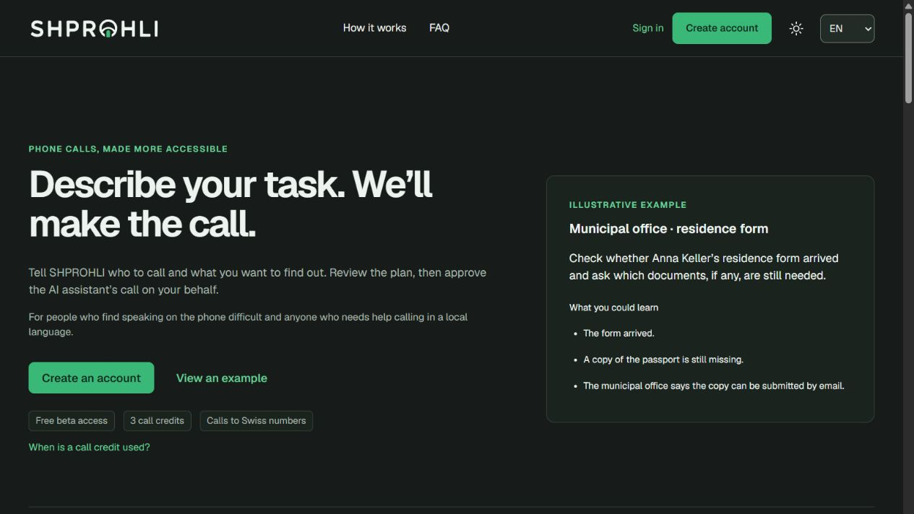
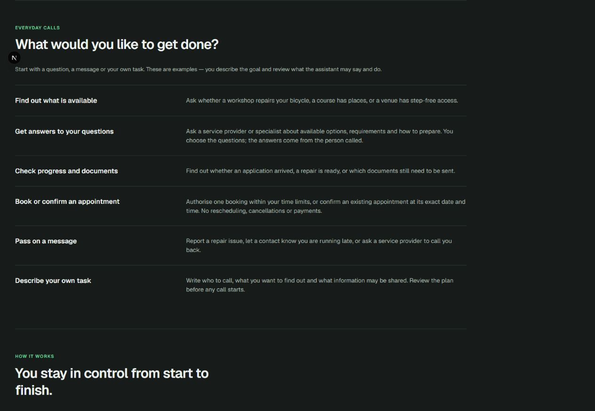
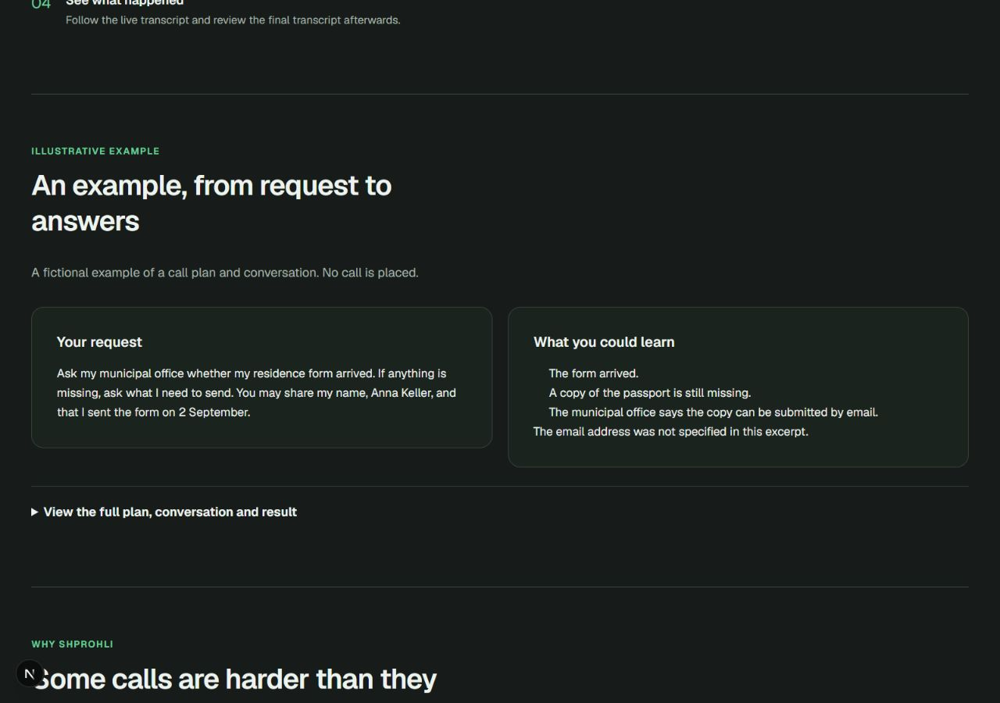
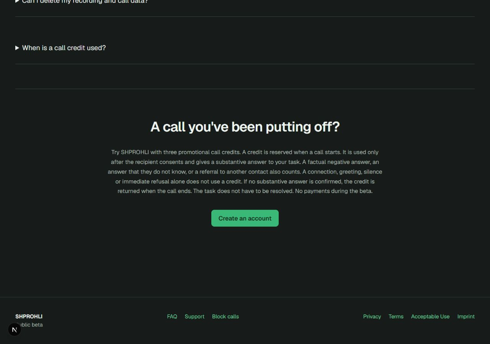

# Продуктовая оценка лендинга SHPROHLI

14 сентября 2026. Проверена опубликованная EN-страница localhost:3000/en в браузере
Codex, тёмная тема, viewport 1280 × 900. Все снимки сделаны и просмотрены в этой
проверке. Код и публикации не менялись.

**Вердикт:** добротная основа для первой беты, ориентировочно 6–7/10 по экспертной
оценке. Страница объясняет механику и ограничения, но доказательств того, что ей
можно доверить реальный разговор, пока мало. Это оценка интерфейса, а не измерение
конверсии или разрешение на публичный запуск всего приложения.

Цель нового посетителя: узнать свою ситуацию, понять работу сервиса, оценить риск
звонка от своего имени и решиться на первую пробу.

## 1. Первое впечатление — хорошая ясность, средняя убедительность

Понятно, что пользователь описывает задачу, проверяет план и разрешает звонок.
Кнопка заметна, оформление спокойно и последовательно. Однако главный заголовок
«Describe your task. We’ll make the call.» подходит почти любому сервису звонков.
Причина выбрать SHPROHLI — трудности речи или местного языка — находится в
небольшом вторичном абзаце. Правая колонка снова объясняет словами, вместо того
чтобы показать реальный интерфейс или дать услышать ассистента.

Предложение: усилить связь первого экрана с трудностью пользователя; показать рядом
короткий согласованный фрагмент настоящего демонстрационного звонка и экран его
результата. Избегать обещания обязательного решения задачи.

## 2. Узнавание своей задачи — покрытие хорошее, подача средняя

Есть информация, консультация с адресатом, документы, встреча, сообщение и собственная
задача. Для первых 30 участников расширять каталог ещё сильнее не требуется.
Одинаковые текстовые строки и общие названия требуют чтения; посетителю полезнее
быстро узнать конкретное отложенное дело. Примеры уже есть, но визуально подчинены
абстрактным категориям.

Предложение: вывести вперёд несколько коротких запросов от первого лица. Если сделать
их выбираемыми, выбор должен действительно переноситься в подготовку задачи, в том
числе через регистрацию. Простая смена CTA без такого поведения вводила бы в заблуждение.

## 3. Проверка обещания через пример — понятна, доказательств недостаточно

Ссылка с первого экрана приводит к примеру; вымышленность явно обозначена.
Краткие запрос и возможные ответы понятны, подробности доступны через раскрытие.
Но используется тот же пример с Gemeinde, что и в hero. Аудио и видео на странице
нет. В видимом примере отсутствует настоящий экран результата. Это оставляет
существенные вопросы о голосе, естественности разговора и том, что получит пользователь.

Предложение: одна убедительная демонстрация — короткая запись с разрешения участников,
понятное обозначение демо, фрагмент плана и реальный экран результата. Нужны также
ясные ответы о согласии, остановке звонка и текстовой поддержке; не вымышленные отзывы.

## 4. Решение попробовать — понятное действие, перегруженное объяснение

Заголовок «A call you've been putting off?» хорошо связан с мотивацией. Под ним
размещён длинный центрированный абзац о резерве, содержательном ответе, незнании,
направлении, отказе и возврате. Он точен, но делает правила учёта главным содержимым
последнего приглашения попробовать. Читателю приходится разбираться в термине
«credit» непосредственно перед регистрацией.

Предложение: оставить краткую суть — бесплатная бета, три пробных кредита, списание
после согласия и ответа по задаче — и заметную ссылку на подробные правила. Сохранить
полное объяснение в FAQ и условиях. CTA должен честно вести к созданию аккаунта.

## Приоритеты и пределы оценки

Первый проход улучшений: первый экран + демонстрация реального продукта + сокращение
финального блока. Общий стиль можно сохранить. Расширять количество сценариев и
добавлять декоративные секции сейчас менее полезно.

Визуально мелкие badges и вторичный текст требуют отдельной проверки читаемости;
длинный центрированный абзац усложняет сканирование. Контраст не измерялся,
screen reader, zoom, мобильная и DE-версии в этом аудите не проверялись. Регистрация
и реальный звонок не выполнялись. Нет аналитики конверсии и наблюдений за новыми
пользователями, поэтому влияние замечаний на регистрацию остаётся гипотезой.

После изменения первого экрана проверить на нескольких новых посетителях, могут ли
они своими словами объяснить, для кого сервис, какой звонок поручат и что их всё ещё
останавливает. Этот отчёт не создаёт отдельный release backlog.
