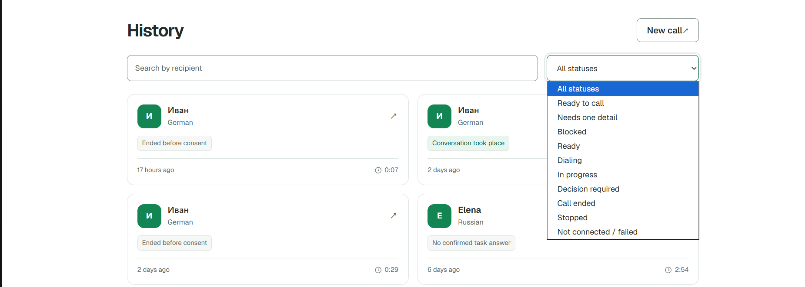
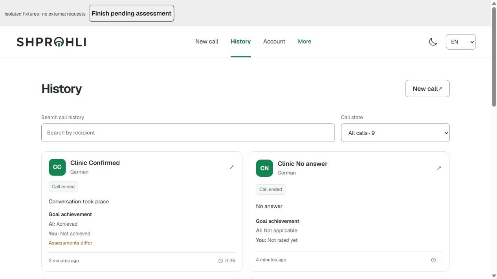
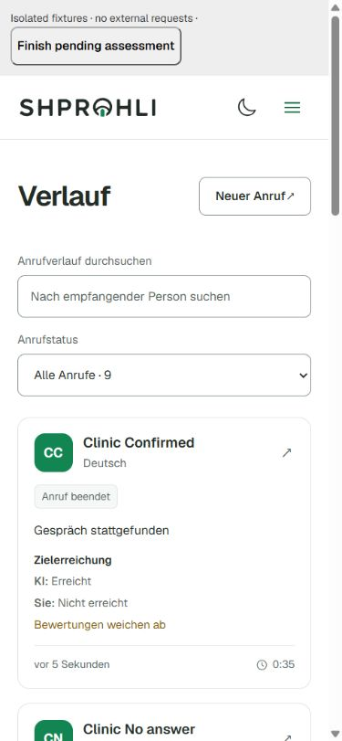

# Статусы звонков и оценки цели: аудит и реализация

Дата: 17 сентября 2026. Согласованные изменения реализованы в рабочей копии. Итоговые правила и проверки записаны в разделе «Результат реализации» в конце документа. Основная часть сохраняет исходный аудит и обоснование решения; описания прежнего поведения и номера строк относятся к моменту аудита.

Согласованное упрощение: в пользовательской истории остаётся один фильтр по состоянию звонка. Итог разговора и оценки ИИ/пользователя отображаются в карточке и деталях; отдельные фильтры для них не входят в текущий объём.

Проверены предоставленный скриншот, текущий рабочий код интерфейса, контракты, API, оба репозитория хранения и существующие тесты. Незакоммиченные изменения интерфейса уже были в рабочей копии до аудита. Это анализ текущего состояния, а не только HEAD.

## Вывод

Разнобой подтверждён. Сейчас словом «статус» обозначаются разные вещи: состояние выполнения, результат разговора, готовность автоматической оценки и достижение цели. Фильтр истории и карточка читают разные поля. Дополнительно разные экраны используют разные словари для одного технического статуса.

Предлагается единая модель представления с четырьмя явно названными полями: **состояние звонка, итог звонка, оценка цели ИИ, ваша оценка цели**. Для них используются общие контракты, общий расчёт представления, общий словарь и одинаковые компоненты. Фильтр при этом один — по состоянию звонка. Существующие технические статусы, оценки и журнал списаний сохраняются как источники данных.

## Визуальная проверка

1. **Просмотр истории — частично консистентен.** Карточки различают «Ended before consent», «Conversation took place» и «No confirmed task answer». Это полезнее технического `completed`, но в карточке не видно, к какому состоянию из фильтра относится этот результат.
2. **Выбор фильтра — несоответствие подтверждено.** В списке нет видимых результатов карточек. Одновременно присутствуют «Ready to call» и «Ready» без объяснения разницы. Пункт «Not connected / failed» объединяет отсутствие соединения и ошибки.
3. **Переход к деталям и оценкам — визуально не проверен.** Локальный `/en/app/history` перенаправил на `/en/login`. Детали, оценки и админка исследованы по исходному коду, а не через авторизованную сессию. Не утверждается, что весь пользовательский сценарий пройден.

На скриншоте результат обозначен текстом, а не только цветом — это удачное решение. В коде фильтр имеет скрытую подпись «Call state» / «Technischer Zustand», но видимая подпись «All statuses» не объясняет его область. Рекомендуются видимые подписи измерений и текстовые обозначения источников оценок. Клавиатурная доступность, контраст во всех темах, мобильный экран и озвучивание обновлений в этом аудите не проверены.

## Что сейчас реализовано

| Слой | Данные | Где используются |
| --- | --- | --- |
| Выполнение | `CallBrief.status`: 10 значений от `review_required` до `failed` | Управление звонком, фильтры истории и админки |
| Итог последней попытки | `lifecycle.result`: 12 значений | Бейджи истории, детали, админка, статистика результатов |
| Оценка ИИ | `lifecycle.assessment.status`, `.conversation`, `.goal` | Детали и агрегаты админки; список уже получает эту информацию внутри lifecycle |
| Оценка пользователя | `latestFeedback.goalResult`: `yes / partly / no` | Отдельная форма в деталях, отдельный endpoint, агрегаты админки |
| Ручная классификация | `latestOutcome.outcome` + `provenance: user / staff / system` | Админка и история ревизий; пользовательский feedback создаёт соответствующую семантическую ревизию |
| Учёт кредита | `lifecycle.credit` и неизменяемый ledger | Резервирование, списание, возврат; это отдельная область |

### Подтверждённые проблемы

**P1. Фильтр и карточка имеют разную семантику.**

- `apps/web/components/call-history.tsx:13` вручную перечисляет технические статусы.
- На строке 75 фильтр вызывает `callStatusLabel({ status: value }, ...)` без lifecycle.
- На строке 87 карточка вызывает тот же helper с полным `brief`.
- `apps/web/lib/call-status.ts:37` отдаёт приоритет `lifecycle.result`, если он есть.
- `apps/api/src/app.ts:2042` и `apps/api/src/storage/postgres-call-repository.ts:563` принимают и фильтруют именно `status`. В SQL используется точное `status = ...`.

Следствие: выбор «Call ended» означает `status=completed`, хотя карточка может говорить о согласии, разговоре или проверке результата. `status=failed` может дать «No answer», «Line busy» или «Technical problem». Из скриншота нельзя установить исходные статусы конкретных четырёх записей; несоответствие доказано контрактом и кодом.

**P1. Процесс оценки смешан с результатом разговора.**

В `packages/contracts/src/call-lifecycle.ts:6` рядом с `no_answer` и `conversation_completed` находятся `assessment_pending` и `assessment_unavailable`. Это разные вопросы. Звонок уже закончился, даже если анализ ещё выполняется. Отказ анализа не доказывает отсутствие разговора или провал цели.

Дополнительная неоднозначность: `deriveCallLifecycle` на строке 124 возвращает `assessment_unavailable` также при `assessment.conversation === uncertain`. Таким образом, результат может быть «не удалось проверить», хотя обработка имеет `status=ready`. В новом представлении нужно читать исходный assessment и различать ошибку обработки и неопределённый вывод.

**P2. Три словаря дают разные названия одного состояния.**

| Технический статус | История | Детали | Админка |
| --- | --- | --- | --- |
| `review_required` | Ready to call | Ready to call | Review required |
| `ready` | Ready | Ready to start | Ready |
| `blocked` | Blocked | Needs changes | Blocked |
| `in_progress` | In progress | Call in progress | In progress |
| `awaiting_approval` | Decision required | Awaiting decision | Awaiting approval |

Источники: `apps/web/lib/i18n/messages.ts:396`, `:456`, `apps/web/lib/i18n/admin-call-messages.ts:118`. Аналогичный разнобой есть в DE. Кроме того, детали отдельно заменяют blocked на сообщение об ошибке подготовки в `live-call.tsx:554`.

`review_required` и `ready` действительно разные состояния: `approveCompilation` фиксирует проверку плана и только затем устанавливает `ready`; `CallService.start` отказывается запускать непроверенный план. Просто объединять два значения нельзя. «Needs one detail» также лучше заменить на «Needs clarification»: название не должно обещать ровно одно уточнение.

**P2. Оценки существуют, но не видны вместе в истории.**

`CallBrief` содержит lifecycle с assessment, однако карточка не выводит оценку цели. Пользовательский feedback в ответ списка вообще не включён. Детали показывают ИИ в `call-lifecycle-summary.tsx:22`, а пользовательскую оценку загружают отдельно через `CallFeedback`. Оценки ИИ и пользователя уже раздельно считаются в `admin-goal-assessments.tsx`; это правильную основу следует сохранить.

**P2. История может показывать устаревшую проверку.**

`CallHistory` загружает данные при изменении поиска/фильтра или переходе на страницу. Подписки и обновления по таймеру нет. В деталях для pending-оценки предусмотрен refresh каждые 3 секунды (`live-call.tsx:213`). Открытая история поэтому может оставаться на «Checking the result», когда детали уже показывают итог.

**Риск при сравнении оценок: различается область данных.**

ИИ привязан к `callAttemptId`, compilation и ревизии транскрипта. `CallFeedbackRevision` привязан к `callBriefId`, без номера попытки. Код и тесты поддерживают несколько попыток одного brief; наличие пользовательского сценария такого повтора в UI не подтверждено. Нельзя автоматически сравнивать оценку старой попытки с новой. Отдельно `latestOutcome` может принадлежать staff, поэтому «ваша оценка» должна читать `latestFeedback`, а не последнюю семантическую классификацию.

## Предлагаемая модель

### 1. Состояние звонка: где мы в процессе

Ввести общий вычисляемый `uiStage`. В техническом `CallBrief.status` значения не переименовывать.

| Исходные данные | `uiStage` | Единая подпись EN / DE |
| --- | --- | --- |
| `review_required` | `review_required` | Awaiting plan review / Planprüfung ausstehend |
| `needs_clarification` | `needs_clarification` | Needs clarification / Klärung erforderlich |
| `blocked` | `blocked` | Cannot start / Start nicht möglich |
| `ready` | `ready` | Ready to call / Bereit zum Anrufen |
| `dialing` | `dialing` | Dialing / Wird gewählt |
| `in_progress` | `in_progress` | Call in progress / Anruf läuft |
| `awaiting_approval` | `awaiting_approval` | Awaiting your decision / Ihre Entscheidung ausstehend |
| `completed`, `stopped`, `failed` | `ended` | Call ended / Anruf beendet |

**Уточнение после проверки точек входа: `review_required` и `awaiting_approval` сейчас имеют разную степень реализации.**

- `review_required` — действующий этап до звонка: пользователь создал задачу, план подготовлен, на странице звонка показан `CompilationReview` (в том числе через `TranslatedPlanReview`). Кнопка `Approve & call` открывает подтверждение запуска; после подтверждения `approveAndStart` одобряет план и запускает звонок. Переход: `review_required → ready → dialing`. `ready` в этом сценарии — промежуточное состояние, не обязательный отдельный экран. См. `apps/web/components/compilation-review.tsx:110`, `apps/web/components/live-call.tsx:473`, `apps/api/src/call-service.ts:666`.
- `awaiting_approval` — предусмотренное ожидание решения пользователя во время разговора по конкретному действию. На странице звонка есть карточка с причиной, предлагаемой репликой и кнопками `Approve` / `Do not disclose` (`live-call.tsx:962`). Решение возвращает статус в `in_progress` независимо от согласия или отказа: отказ относится к предлагаемому действию, а не означает остановку всего звонка.
- **Сейчас единственная вызывающая ветка создания такого запроса — `telephonyProvider.mode === "mock"`**, где через 5,2 секунды запрашивается разрешение сообщить демонстрационный email (`call-service.ts:785`, `:804`, `:1666`). Обработчик решения также продолжает демонстрационный сценарий с записью реплики и отложенным завершением (`:1092`). В реальном Twilio/OpenAI Realtime сценарии создание и исполнение пользовательского approval не подключены. Наличие enum, API и карточки не означает готовность этой функции для реальных звонков.
- После подтверждения пользователя `awaiting_approval` убран из обычных вариантов фильтра истории. Статус сохранён в контракте и отображении существующих/демонстрационных записей. Старый прямой URL `?status=awaiting_approval` сохраняет точную фильтрацию и отображает выбранное значение, которое скрыто из обычного меню. До подключения функции в реальных звонках возвращать этот пункт не следует. Оба статуса относятся к разрешению действия; ни один не означает ожидание послезвонковой оценки ИИ или feedback пользователя.

«Завершён» означает только окончание попытки. Причина завершения находится в итоге звонка. Например, отсутствие ответа не становится технической ошибкой из-за внутреннего `failed`. На странице подготовки объяснение «Cannot start» уточняет причину: проверка правил, недостающие сведения или ошибка подготовки.

Админка использует те же пользовательские подписи; исходный технический статус при необходимости показывает отдельным диагностическим полем. Проверки допустимости действий продолжают использовать существующие доменные правила. `blocked` нельзя глобально объявить завершённым звонком только потому, что один из backend helpers считает его терминальным для provider callbacks.

### 2. Итог звонка: что удалось установить

Итог показывается отдельной строкой или бейджем с собственной подписью. Отдельный фильтр по итогу в текущем предложении не нужен.

| Текущее значение | Представление |
| --- | --- |
| `conversation_completed` | Разговор состоялся / Conversation took place |
| `no_answer` | Не ответили / No answer |
| `busy` | Занято / Line busy |
| `canceled` | Отменён до соединения / Canceled before connection |
| `consent_declined` | Отказ от разговора / Conversation declined |
| `consent_not_received` | Завершён до подтверждения согласия / Ended before consent |
| `no_substantive_answer` | Ответ по задаче не подтверждён / No confirmed task answer |
| `technical_failure` | Техническая проблема / Technical problem |
| `stopped` | Звонок остановлен / Call stopped |
| `ended`, недостаточно фактов | Итог не установлен / Outcome unknown |
| `assessment_pending` | Итог пока не установлен; отдельно «ИИ: оценивается» |
| `assessment_unavailable` | Итог не установлен; точное состояние ИИ берётся из assessment |

Для незавершённого звонка итог отсутствует, а не равен «неуспеху». Не смешивать «Не ответили» с «Нет подтверждённого ответа по задаче»: во втором случае соединение и согласие уже могли быть.

На переходном этапе адаптер читает существующий `lifecycle.result`. В целевой проекции результат разговора не кодирует состояние задания оценки. Подтверждённые факты соединения и согласия остаются доступны даже при недоступном анализе. Старая запись без достаточных данных остаётся неопределённой; из отсутствия assessment нельзя вывести `conversation=absent`.

### 3. Оценка цели ИИ: готовность и вывод — разные поля

| Состояние обработки | Подпись |
| --- | --- |
| Не применимо | Не требуется — звонок не дошёл до оцениваемого разговора, если это подтверждено фактами |
| Не оценено | Оценки нет; например, историческая запись без assessment |
| `pending` | Оценивается |
| `ready` | Вывод готов; показать одно из четырёх значений ниже |
| `unavailable` | Не удалось оценить; подробная причина в деталях |

Готовый вывод: **цель достигнута / частично достигнута / не достигнута / не удалось определить** (`achieved / partial / not_achieved / uncertain`). `ready` не означает успех; `uncertain` не означает ошибку генерации. `not_applicable` и `not_assessed` — состояния новой проекции; их сейчас нет в assessment schema, и их нельзя выводить только из отсутствующего объекта.

### 4. Ваша оценка цели

Привести отображение к тому же словарю: `yes → achieved`, `partly → partial`, `no → not_achieved`. Оригинальные записи сохранять. Отсутствие feedback обозначать «Вы ещё не оценили», а не «Цель не достигнута».

Для незавершённой попытки или подготовки не предлагать оценку раньше существующих правил доступности. Если цель пользователь не может оценить, он может пока не отвечать; добавление отдельного ответа «Не могу оценить» — самостоятельное изменение формы и контракта, не обязательное для исправления консистентности.

## Карточка и один фильтр

Пример содержимого карточки завершённого звонка:

> **Иван · German**\
> Состояние: звонок завершён\
> Итог: разговор состоялся\
> **Цель — ИИ: достигнута · Вы: частично**\
> Оценки различаются\
> 2 дня назад · 0:35

Это пример предлагаемого содержания, не новый визуальный макет. Состояние можно оставить небольшим нейтральным бейджем, итог — заметной строкой. Оценки должны иметь подписи источников. На незавершённых карточках показывать этап и требуемое действие; пустые строки оценок не нужны.

В верхней строке истории: поиск и один подписанный фильтр **«Состояние звонка»**. Отдельных фильтров по итогу, оценкам и расхождениям не добавлять, в том числе в скрытую панель дополнительных настроек. Эти сведения остаются в карточках и деталях. Такой объём выбран после замечания пользователя о лишней сложности двух фильтров.

Единый dropdown содержит только состояния процесса. В него не добавляются «Цель достигнута», «ИИ оценивается» или «Оценки различаются»: иначе разные поля снова смешаются под словом «статус».

Правило консистентности: пункт фильтра совпадает с полем состояния карточки и деталей по идентификатору, подписи и смыслу. «Call ended» выбирает все завершённые попытки. «Conversation took place» остаётся пояснением итога внутри карточки. Не использовать старое `status=completed` как синоним всех завершённых попыток. Удаление `awaiting_approval` само по себе ещё не реализует эту новую группировку.

## Как учитывать две оценки

1. Хранить и показывать ИИ и пользователя независимо. Ответ пользователя не переписывает вывод ИИ, а вывод ИИ не исправляет мнение пользователя.
2. Для сравнения использовать одинаковые значения `achieved / partial / not_achieved` и одну область: попытку и утверждённую задачу. Неопределённый вывод, pending, отсутствие feedback и неоднозначная привязка дают `not_comparable`, а не конфликт.
3. Если оба сопоставимых значения известны: одинаковые → `match`, разные → `mismatch`. Это вычисляемый признак, не новый статус звонка.
4. По умолчанию не вводить единую «истинную оценку». Если продукту позже понадобится краткий пользовательский итог, можно отдавать приоритет явному feedback с подписью «По вашей оценке», иначе ИИ с подписью «По оценке ИИ». Исходные оценки и расхождение сохраняются.
5. Staff-классификацию держать отдельно. Она не подменяет пользовательский feedback и не меняет метрики качества ИИ.
6. Качество транскрипта — отдельная оценка артефакта, не степень выполнения задачи.
7. Факт разговора, достижение цели и списание кредита не тождественны. Неуспешная цель может сопровождаться содержательным ответом; поздний подтверждённый результат может сосуществовать с уже возвращённым кредитом. Эта политика уже реализована и должна сохраниться.

Для новых feedback-ревизий рекомендуется явно сохранять `callAttemptId` и контекст задачи. Старые ответы привязывать автоматически только при однозначной истории; остальные обозначать как относящиеся к звонку в целом и исключать из сравнения попыток. До этого нельзя надёжно показывать признак расхождения для всех записей.

## Реализация по этапам

**1. Устранить видимое несоответствие.**

Создать общий типизированный словарь EN/DE для состояний, итогов, выводов оценки, обработки и тонов оформления. Убрать три fallback-словаря и частный текст failed внутри dropdown. Разделить helpers состояния и итога вместо неоднозначного `callStatusLabel`. Показывать одинаковые поля на истории, recent calls, деталях и админке. Сразу различить проверку плана и готовность к запуску.

**2. Дать списку полное представление и один согласованный фильтр.**

Добавить общий контракт `CallHistoryItem` / `CallPresentation` с `stage`, `conversationResult`, `aiAssessment`, кратким `userAssessment`, `comparison`, `attemptId` и версией проекции. Названия полей здесь предлагаемые. Не передавать в каждую карточку полный feedback-комментарий или цитаты транскрипта.

API списка должен получать feedback пакетно, без отдельного запроса на каждую карточку. Единственный новый параметр фильтра состояния `stage` задаётся через общий валидируемый контракт и сочетается с поиском получателя. Фильтры `result`, `aiGoal`, `aiState`, `userGoal`, `userFeedbackState`, `comparison` в текущий объём не входят. Отсутствие записи и ошибка загрузки API различаются.

Фильтр состояния выполняется в SQL до `LIMIT`; например, `stage=ended` соответствует `status IN ('completed', 'stopped', 'failed')`. Для одного такого фильтра отдельная материализованная read model не нужна. Итоги и оценки можно по-прежнему добавлять пакетно к уже выбранной странице. Если позже понадобится фильтрация по этим полям, её потребуется выполнять до пагинации; фильтровать только 20 загруженных карточек нельзя.

Сохранить фильтрацию владельца и удалённых данных, устойчивый cursor `(createdAt, id)`, одинаковые предикаты для списка и счётчиков. Старый URL `status=` не переосмысливать молча: сохранить его точную техническую семантику как совместимый фильтр с понятной меткой или явно мигрировать ссылку. После реализации группировки новые ссылки используют `stage=`.

**3. Обновление и проверка согласованности.**

Обновлять открытый список при активном звонке или pending-оценке; прекращать частый polling после завершения обработки. Обновлять при возврате фокуса и после изменения feedback. Поздняя готовая оценка должна обновить представление, сохранив уже завершённое списание/возврат. При изменении фильтра отменять старые запросы и сбрасывать пагинацию, как уже частично делает текущий request counter.

До перехода всех экранов использовать совместимый адаптер к существующим данным. Не переименовывать сохранённые enum ради подписей интерфейса, не переписывать старые оценки и не запускать массовую повторную оценку исторических звонков.

## Приёмочные сценарии

| Сценарий | Ожидаемое представление |
| --- | --- |
| План подготовлен, ещё не одобрен | Ожидает проверки плана; не Ready to call |
| План одобрен | Ready to call на всех экранах |
| Provider no-answer + `failed` | Завершён; не ответили; без автоматического вывода «цель не достигнута» |
| Соединение без подтверждения согласия | Завершён; завершён до согласия; готовая оценка не выдумывается |
| Разговор завершён, анализ pending | Завершён; итог пока не установлен; ИИ оценивается |
| Содержательный отказ/перенаправление, цель не достигнута | Разговор состоялся; ИИ: цель не достигнута |
| `ready` assessment с `goal=uncertain` | Анализ выполнен; вывод неопределённый, не ошибка выполнения |
| Ошибка/таймаут анализа | Не удалось оценить; не делать из этого отрицательную оценку цели |
| ИИ achieved, пользователь no | Обе оценки видны; mismatch при совпадении области данных |
| Пользователь не ответил | Без вашей оценки; не no и не mismatch |
| Staff изменил semanticOutcome | Ваша оценка продолжает браться из latestFeedback |
| Новая попытка и feedback предыдущей | Старый feedback не сравнивается с новой оценкой автоматически |
| Поздняя положительная оценка после возврата | Результат обновлён; кредит остаётся возвращённым |
| Историческая запись без достаточных фактов | Итог не установлен; отсутствие оценки не выдаётся за отсутствие разговора |
| Совпадения за пределами первой страницы | Сервер находит их до LIMIT; нет пропусков/дублей при пагинации |
| Смена EN/DE, история/детали/admin | Один смысл, один словарь; одинаковые фильтры и показатели |

## Выполненная проверка и пределы

Запущены существующие тесты через установленный `node_modules/vitest/vitest.mjs`:

- Contracts: `call-lifecycle.test.ts`, `call-outcome.test.ts` — 13 passed.
- Web: `call-status.test.ts` — 8 passed.
- API: `credits/final-assessment.test.ts`, `storage/final-assessment.test.ts`, `storage/call-outcome.test.ts` — 31 passed.
- Всего: **52 passed, 6 файлов**. Обычный запуск через `pnpm exec vitest` не нашёл Windows launcher; прямой запуск установленного Vitest завершился успешно.

Эти тесты проверяют существующую реализацию: разделение оценки цели и разговора, пользовательский feedback, доказательства, поздние результаты и кредит. Они не подтверждают работоспособность предложенной новой модели или исправление интерфейса. PostgreSQL integration, новые фильтры, browser E2E, production-данные и точность LLM на реальных звонках в этом аудите не проверялись.

После удаления `awaiting_approval` из обычного меню отдельно прошли TypeScript-проверка web-приложения и ESLint для `call-history.tsx`. Для ESLint использован уже установленный плагин из зависимостей Next через локальный `NODE_PATH`; зависимости проекта не менялись. Авторизованная визуальная проверка этой правки не выполнялась.

## Результат реализации

Один пользовательский фильтр **Call state / Anrufstatus** использует ту же модель и словарь, что и состояние карточки. Его полный набор:

| Пункт EN | Пункт DE | Данные |
| --- | --- | --- |
| All calls | Alle Anrufe | Без ограничения по состоянию |
| Awaiting plan review | Planprüfung ausstehend | `review_required` |
| Needs clarification | Klärung erforderlich | `needs_clarification` |
| Cannot start | Start nicht möglich | `blocked` |
| Ready to call | Bereit zum Anrufen | `ready` |
| Dialing | Wird gewählt | `dialing` |
| Call in progress | Anruf läuft | `in_progress` |
| Call ended | Anruf beendet | `completed`, `stopped`, `failed` |

Пункты отображаются в этом порядке, только при ненулевом количестве записей. Счётчики вычисляются по всей доступной пользователю истории с учётом поиска получателя, до выбранного состояния и пагинации. Выбранный пункт остаётся в меню даже при нуле. При отсутствии выбранного пункта и наличии не более одного состояния фильтр скрывается. Сброс исчезающего фильтра возвращает клавиатурный фокус в поиск. `awaiting_approval` отсутствует в обычном меню. Старые ссылки `status=` сохраняют точную техническую семантику и явно подписаны; новые ссылки используют `stage=`.

Карточка завершённого звонка показывает состояние, итог разговора и блок достижения цели с двумя независимыми источниками — AI/KI и You/Sie. Состояния анализа pending, unavailable, отсутствие оценки и неопределённый готовый вывод различаются. Отсутствие оценки не превращается в отрицательную оценку. Оценки используют общий компонент на истории, в деталях и инспекторе администратора. Администратор сохраняет технический фильтр с явной подписью «Technical state» для диагностики.

В текущей схеме пользовательский feedback не содержит attempt ID. Поэтому сравнение с ИИ разрешено только при одной попытке, начатой до сохранения feedback. При нескольких попытках или недостаточных данных отображается примечание, что это оценка звонка в целом, без автоматической отметки расхождения. Точная привязка feedback к попыткам требует отдельного изменения модели записи. Существующие данные и расчёт кредитов не переписывались; миграции не нужны.

Контракт и правила проекции находятся в `packages/contracts/src/call-history.ts`; общий словарь — в `apps/web/lib/i18n/call-presentation.ts`. API возвращает счётчики и минимальную последнюю пользовательскую оценку пакетно, без комментария и отдельного запроса на каждую карточку. PostgreSQL читает список, счётчики и оценки в одном snapshot. Сохранены ограничения владельца, исключение удалённых данных и cursor `(createdAt, id)`. Поиск `%`, `_` и `\` работает как поиск буквального текста.

Открытая история обновляется при активных звонках, ожидающих оценках, возврате фокуса и сохранении feedback. Уже загруженная глубина списка сохраняется при фоновом обновлении. После завершения обработки частый polling прекращается.

### Проверка реализации

- Web: весь набор — **247 тестов, 49 файлов**.
- Contracts: история, lifecycle и outcome — **20 тестов**.
- API: обработчик списка, in-memory история, feedback и final assessment — **42 теста**.
- PostgreSQL: **3 интеграционных теста** в отдельной автоматически созданной тестовой базе, включая серверные счётчики, поиск, пагинацию, изоляцию владельцев и область feedback в истории/деталях/admin.
- TypeScript для web и API, ESLint изменённых компонентов и `git diff --check` — без ошибок.
- В браузере на изолированных фиктивных данных проверены настоящие React-компоненты: EN/DE, светлая и тёмная тема, мобильный экран 390 px, фильтр с нулём, скрытие фильтра и фокус, автоматическое завершение оценки, изменение пользовательской оценки и исчезновение расхождения.

Браузерная проверка не является авторизованным E2E на реальных звонках: локальное приложение требует входа. Production-развёртывание, реальные звонки и повторный запуск LLM не выполнялись. Для уже запущенного процесса API требуется загрузить обновлённый код; web и API должны использовать новый контракт вместе.
