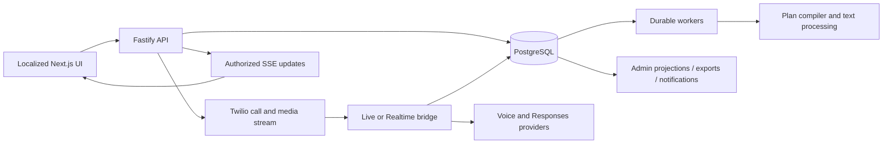

# SHPROHLI engineer guide

Source checkpoint: 2026-10-07, including call review and owner result emails,
schema catalog `0001`–`0109`. This describes the
implementation, not the currently deployed environment. Deployment runbooks,
recovery procedures and VPS topology are local, ignored operational materials.
The dated implementation records in the [documentation index](README.md) retain
their original verification scope; they are not current deployment status.

## Repository and ownership

| Location | Responsibility |
| --- | --- |
| `apps/web` | Next.js App Router UI, localized public/authenticated pages and admin console |
| `apps/api` | Fastify API, session authorization, PostgreSQL repositories, provider integrations and workers |
| `packages/contracts` | Zod request/response schemas, domain types and shared validation |
| `apps/api/src/db/migrations` | Immutable, ordered SQL catalog with checksum ledger |
| `apps/api/src/voice` | Live/Realtime sessions, PCMU transport, consent/disclosure, playback and action authorization |
| `apps/api/src/brief-compiler` | Model compilation, moderation, execution-language checks and deterministic policy |
| `apps/api/src/text-processing` | Plan review translation, transcript translations, summaries and final assessment |
| `apps/api/src/storage` | Durable calls/attempts, immutable revisions, usage/credit writes and admin projections |
| `apps/api/src/credits`, `beta` | Period allowances, credit funding and service admission/spending controls |
| `apps/api/src/safety` | Recipient suppression and returned-plan case review |
| `apps/api/src/telemetry-export` | Snapshot selection, ZIP generation, retained audio, expiry/revocation |
| `apps/api/src/notifications` | Separate superadmin and owner delivery outboxes, reports and localized emails |
| `apps/api/src/content` | CMS seeds, editorial collections and exact public-copy upgrades |
| `apps/web/lib/i18n` | Static interface dictionaries; distinct from published CMS content |

Node.js >=22.19 and pnpm 10.12.4 are declared in the root package. CI uses
PostgreSQL 17. Use the lockfile for exact dependency versions. All four first-party
packages are private and `UNLICENSED`; third-party licenses/notices remain intact.

## Process and data flow



`src/index.ts` starts the API, `src/worker.ts` the external worker. Embedded worker
mode exists for local development; production configuration validates real
providers, durable storage and required configuration. `app.ts` composes route
groups and repositories. `CallService` coordinates workflow; repositories own
transactional invariants. In-memory implementations support deterministic tests
and mock development, with the same public contracts where supported.

PostgreSQL is authoritative. Persist state and an idempotent operation before
network work, then record provider completion. Do not infer a durable state solely
from a websocket event or browser timer. Jobs are leased and renewed, bounded by
generation/attempt budgets and checked before publication. Dedicated preparation,
operations and background roles have separate lanes; preparation/review support
bounded concurrent slots. Database admission enforces global/user/provider limits
across processes. Unique claim ownership and lease fencing prevent stale publication.
Workers abort provider IO after lease loss and bound shutdown drain. See the
[preparation runtime](preparation-runtime.md) for limits, policy and diagnostics.

## User and call lifecycle

Registration verifies phone possession and captures the configured legal agreement.
Email verification is required by default; explicit deferral is available only when
enabled. Deferral does not mark an address verified. Current policy gates new calls.
Roles and sensitive reads are checked server-side, not only by hiding controls.

Admin registration policy can restrict account phones to Switzerland. It applies
to registration, unverified-phone correction, verification/resend and phone changes,
including pending confirmations. The server rechecks policy before provider IO
and within mutations. Verified foreign accounts retain login and recovery. All
seven UI locales hide the country selector and change guidance when enabled.
Outbound recipient eligibility remains a separate policy.

A preparation request is idempotent for the account and request key. It stores the
input and a durable compilation job. Compilation produces an immutable revision
with raw/compiled brief, moderation results, policy decision, model/compiler
versions and snapshot hash. Edits create another revision. Approval binds a precise
revision/hash and original or translated review receipt. A stale approval cannot
authorize a changed plan. A recompile that fails before publication preserves the
previous revision; a published returned plan still needs correction and fresh approval.

The approval page starts with a compact objective, recipient and important conditions;
the full plan is collapsed in expandable details. Approval/edit actions stay in a
sticky desktop sidebar or a fixed mobile bottom bar, with reserved content space,
device safe area and clearance for the privacy notice. Very short viewports use an
in-flow action panel. Revision/translation evidence, blocking/expiry checks and the
final confirmation dialog still govern approval. The landing demo owns a complete
light token palette so nested plan/result components remain readable in either
outer theme.

New call attempts pass recipient suppression, account/email/phone eligibility,
service limits, budget admission, approved-plan and credit checks transactionally.
The frozen execution snapshot owns runtime language/voice/plan/permissions. Each
attempt has its own provider lifecycle, credit reservation, recording and usage.
Repeated calls are separate attempts or newly reviewed drafts according to the
repeat workflow; they do not overwrite earlier evidence.

Transport completion, no answer, voicemail, consent refusal, missing consent,
substantive conversation, task outcome and user feedback are different facts.
Credit settlement follows the substantive-answer policy, not mere call connection
or whether the user's objective succeeded. A negative factual answer or referral
can count as substantive. Assessment uncertainty has a bounded settlement path.

## Current voice runtime

Default `VOICE_RUNTIME_DRIVER=live`, `VOICE_RUNTIME_LIVE_FALLBACK=false`. One
`UnifiedLiveCall` manages the native session from admission/disclosure through
conversation and closing. Realtime and legacy hybrid fallback remain deliberate
compatibility code; removing them requires a separate supported-runtime decision.
The source runtime identifier is `live-managed-v9`.

Live handles ordinary speech and native Responses delegation. The application owns
the hard boundaries: validated tool schemas and permissions, consent, recording,
disclosure playback, appointment confirmation and the final hangup. A managed
decision can resolve settled input missed by native delegation; there is no separate
ordinary-reply semantic classifier. Calendar/appointment authorization remains
within the approved time windows and no-new-financial-terms policy. No external
calendar integration is implied.

For native Live, AMD runs alongside disclosure. Explicit machine/fax outcomes have
their own policy; `unknown` is inconclusive. A later AMD callback cannot reverse
accepted consent. Consent tools are restricted to the consent stage. Recording
and task access wait for the required consent/disclosure/recording conditions.
Pre-consent recipient audio/transcript is not retained as conversational evidence.
Admin System selects `semantic_native` (the default) or
`hybrid_deterministic_v1`; each attempt pins the policy revision. Hybrid uses a
200 ms fast settle window for deterministic replies and a 900 ms semantic settle
window for ambiguous replies. Live transcript deltas do not guarantee utterance
completion: the accepted short-window prefix risk remains explicit. Negative or
qualified replies take precedence; unclear input retains semantic, clarification
and DTMF fallback. `assistanceReason` defaults to `none`; the two assistance
reasons remain explicit opt-ins in the approved disclosure snapshot.

The audit binds disclosure playback to the consent decision and its method
(`deterministic_voice`, `semantic_voice` or `dtmf`), recording request and provider
recording ID. After recording admission, v9 opens audio forwarding before sending
task context, so early native speech is preserved. Context acknowledgements gate
the separate task-start instruction, without moving the audio or transcript
boundary. That instruction does not establish when speech will arrive. Background
speech is a leading hypothesis for one delayed production opening; a quiet-room
comparison is pending. See the [dated call analysis](live-runtime-stability-plan-2026-10-04.md).

Application-owned speech and terminal playback are journaled; hangup waits for the
correct uncleared playback mark. Recipient corrections and interrupted playback
are handled explicitly rather than treating an attempted send as heard speech.
Closing playback is idempotent. Managed task decisions use the later of the
settled-answer grace (5 seconds) and last native voiced-packet quiet window
(2 seconds), with readiness and backend-occupancy checks; these are not an
opening-speech delay timer.

Each new native attempt records a runtime descriptor before OpenAI Live/TTS startup:
runtime version, optional validated release SHA, compiler/policy versions,
hashes of instructions and compilation, models, voice, locale and disclosure
version and pinned consent policy. The optional release value comes from a valid
40-hex `SHPROHLI_RELEASE_SHA`.
It contains hashes, not raw prompts, and is cleared by call/account deletion.
Historical missing descriptors stay null. A code/config change does not
retroactively identify an old call's runtime.

## Preparation latency and diagnostics

Each new preparation pins its model/tier policy and, by default, a 120000 ms deadline, including
queue time, provider requests and durable retries. `CALL_PREPARATION_TIMEOUT_MS`
can impose a smaller process ceiling.
`OPENAI_BRIEF_COMPILER_TIMEOUT_MS` is a second compile-level ceiling. Generation requests
default to 35 seconds; moderation retains its own bounded timeout. Output moderation
gets reserved time. No safety stage is removed to shorten waiting.

Superadmins select generation model (`gpt-5.6`, `gpt-5.6-terra`, `gpt-6-luna`)
and Standard/Fast directly; no evaluation report is required and the comment is
optional. Audit and automatic plan review retain `gpt-5.6:default`. Existing jobs
retain their policy snapshot; saving settings does not issue a provider request.
Recipient labels may be people or organisations; supported full-token normalization
and source-attested forms do not permit invented names, addresses or references.

Generation/audit use SSE. The reader cancels more than 256 consecutive JSON
formatting whitespace characters outside strings (`OPENAI_STREAM_PADDING`). Initial
compilation can use one compact-JSON schema repair without resetting deadlines or
request limits. Repeated padding fails. Numeric stream counts/timing are recorded;
raw output is not. Unknown cancelled remote work keeps its permit until expiry.

The requested 10–15 second target and 30-second end-to-end ceiling are not enforced
by this implementation. Automatic review translation is a separate durable job;
its profile is pinned, but it does not share the preparation deadline. Browser
recovery polling can last eight minutes. Faster failure is not faster successful
preparation. See [preparation runtime](preparation-runtime.md) for exact boundaries.

Provider requests identify input moderation, initial compilation, compilation repair,
language audit and output moderation. Metadata includes repair kind/number,
transport attempt, planned timeout and remaining deadline before journaling. Actual
request duration comes from result timestamps; time spent journaling can reduce the
effective provider timeout. The admin preparation
inspector shows initial queue delay, stage timing, errors and attempts. Historical
rows without request metadata are explicitly incomplete. Public status uses localized
stage labels; browser polling never authorizes a second paid compilation by itself.

Optional result diagnostics now separate reservation, dispatch/socket/body send,
response headers, body read/parse and numeric provider processing/rate-limit
metadata. The inspector and export preserve missing historical evidence as
unknown. Overlapping offsets must not be summed; waiting for headers does not
prove provider processing time. No raw prompts, headers or audio are added.
See [transport diagnostics and measurements](preparation-latency-diagnostics-2026-10-04.md).

The audit found a small local sample's long tail dominated by provider/network
failures and retries; short initial queue times do not prove zero congestion under
load. New limits bound delay and expose its cause. They are not a claim of measured
production latency improvement. Tune from stage percentiles and completion/error
rates together, not successful latency alone.

## Credits, allowances and admission

The immutable credit ledger records grant/reserve/charge/refund; funding provenance
distinguishes persistent/manual/promotional balance from a beta period. Existing
balances are preserved. Beta policy is versioned; the initial policy remains
3 credits for a lifetime. Admin > System separates allowance policy from attempt
limits and spending controls.

Policies support 0–100 credits for `lifetime`, `day`, `week` or `month`. Periods use
UTC calendar boundaries, weeks start Monday, months start on day 1. Unused period
credits do not roll over. Period grants are materialized lazily and idempotently;
there is no monthly cron whose failure can issue duplicate grants. Concurrent call
starts must serialize last-credit admission. Beta funding is consumed before
persistent funding. Refunds return to the original funding period; an expired
period refund does not enlarge the next period's allowance.

Saving a policy changes enrollment for new registrations. Applying it to existing
accounts is a separate preview/apply operation with expected revision, snapshot
token and audit reason. It does not silently reset balances on every settings save.
The preview reports affected accounts, immediate/next-boundary transitions,
persistent credits and active reservations. Pending effective changes and funding
breakdown are visible in account/admin credit views. Existing period boundaries
are respected; active reservations retain their original provenance.
Existing-account transition targets active users with verified phones. Transitioning
an existing account to a lifetime policy does not issue a second signup grant;
the interface distinguishes that fact from a new registrant's one-time allowance.

Public registration options expose `open`/`full`, the current allowance and UTC
semantics. When seat display is disabled, `remaining` is null, not a hidden DOM
value. Available seats are derived from the same registration-cap accounting used
inside account creation. Concurrent last-seat attempts cannot oversubscribe the
cap. The preview is informational; final admission is transactional.
Intake counts retained registration slots, including unfinished/deleted registrations;
it is not a count of currently active users. Invitation capacity is additional to
open-registration capacity and follows its own admission rules.

Budget reservations are not actual expenses. Service spending has a separate
reservation/journal model. Failed/refunded calls still count toward attempt limits.
Changing caps does not delete accounts or interrupt already admitted calls.

## Costs and accounting

| Evidence | Interpretation |
| --- | --- |
| Credit ledger | User entitlement; never a provider currency amount |
| Provider operation | Intent/admission before dispatch, including requests with lost responses |
| Provider result/usage | Returned quantities/status; absence may still mean a charge |
| Versioned estimate | Quantities priced against the saved tariff version |
| Provider-reported cost | Actual amount/currency returned for an operation/telephony leg |
| Account billing snapshot | Provider account-level reconciliation evidence with scope and coverage |
| Budget reservation | Conservative capacity held to prevent overspending |

OpenAI totals contain OpenAI operations. Twilio ancillary estimates (AMD/voicemail)
and telephony reported costs remain Twilio. Application-rendered speech is a speech
category, not text generation. Live sessions and failed paid operations without
usage remain visible in the request drilldown. Missing usage is
`usage_unknown_possible_charge`, never a zero-cost success.

Estimates use the saved pricing version and usage provenance. AMD uses request
count; voicemail uses captured character count; speech uses its measured duration
where supported. Known historical version aliases remain interpretable. Unknown
tariffs or missing quantities remain unpriced. Do not add reported actuals and an
estimate for the same service. Do not sum different currencies or present a partial
estimate as a complete invoice. Provider billing snapshots may cover a broader
account or timezone than the selected application's operations.

The expense explorer separates Cost / Usage / Requests and displays incomplete
coverage. Pricing definitions are in `config/provider-pricing-policy.ts`, request
journaling in repositories, and admin display helpers in `apps/web/lib/admin-costs.ts`.
Tariff changes require a new version rather than rewriting historical estimates.

## Telemetry, transcripts and audio export

Structured telemetry excludes raw provider error messages and sensitive prompt
content. Operational logs use PII-safe error reporting. Native transcript capture,
application playback, terminal decision, assessment and credit evidence are
separate persisted sources. "First audio sent by application" measures application
egress, not what the recipient heard; playback acknowledgement is stronger evidence.

Primary transcript source is Live. Recording ASR is an owner-requested additional
source, not automatic recovery triggered by page reads or callbacks. Transcript
revisions are immutable; summaries and translations reference their source/hash.
Incomplete native captures retain quality flags. Recording retention does not
imply deleting the retained textual source unless the wider deletion policy applies.

In the live browser view, persisted fragments are sorted by arrival order and
pending SSE fragments follow the saved prefix. Session/event identity deduplicates
snapshot/SSE overlap; grouping uses that combined order rather than comparing
speech timestamps with database receipt times. Native partials display their speech
timestamp instead of the generic live label. These UI changes do not rewrite
stored transcript boundaries or certify that a fragment was audibly played.

Admin telemetry export v2 includes native captures, immutable contexts/revisions,
terminal/action evidence, preparation diagnostics, runtime descriptors, budget and
beta credit provenance, and scoped plan-review evidence. Explicit source inventory
tests guard new persisted tables and columns. Direct transcript attribution,
legacy inference and unknown provenance are distinct; export does not invent old
runtime metadata. Preview shows record coverage and approximate WAV size.

The period selects attempt start times and preparation creation times. Export
includes associated retained history and recordings for those calls, including
attempts outside the selected period. New exports default to include audio;
metadata-only remains an explicit option. Eligible recordings
must be available, consented, not deletion-pending and within a known retention
deadline. The database snapshot completes before provider network streaming.
Audio is fetched one recording at a time, with the stored channel count. No ASR is
triggered by export. The manifest records status/reason, byte length, checksum,
channels and linkage for each recording, including unavailable/missing sources.

Limits: 64 MiB per recording, 250 MiB audio and a separate 250 MiB structured-data
limit per archive. Oversized exports fail with narrower-period guidance; automatic
multipart exports are not implemented. A missing recording/404 is explicit partial
coverage; a broken stream fails that generation rather than shipping truncated audio.
Build leases renew and jobs have a 30-minute deadline. Ready exports expire at the
earlier of 24 hours or the earliest eligible recording retention deadline. Build
fencing and per-part download checks revoke archives after deletion, consent
revocation or shortened retention. Files already downloaded cannot be recalled.

## Returned plans and superadmin review

Admin > Safety opens Plan reviews; Recipient protection is the adjacent tab.
Overview, user and call screens link to the corresponding cases. A case belongs to
an immutable returned compilation revision. Categories distinguish policy signal,
ordinary clarification, unsupported task and technical failure. A returned plan is
not by itself evidence of abuse.

The publication transaction inserts the case and durable notification event.
Default notification policy covers all returned plans; signals-only is optional.
Historical backfill is dry-run by default and deliberately sends no retroactive
email. Delivery status/failure/retry is visible with audit evidence. Emails contain
validated reason/version/case metadata and a console link; raw briefs, contacts and
transcripts stay behind superadmin sensitive-access authorization and a reason.
Localized HTML/text rendering escapes data and follows recipient language.

Case triage uses revision checks, status/assignee/disposition, encrypted notes and
an audit trail. Detailed revision evidence and diffs require a sensitive-access
reason. Read and mutation permissions, CSRF, account deletion and source deletion
are rechecked server-side. Email delivery retries create an audited fresh generation;
they do not manufacture or overwrite the original incident.

## Owner result emails

Migration `0109` creates `user_call_notifications`, separate from superadmin settings
and recipients. An attempt's first `ended_at` transition enqueues in the completion
transaction for an active owner with a verified email, available call data and no
pending account deletion. Existing completed attempts are not backfilled. The
PostgreSQL-only consumer runs in embedded development or external `background`/`all`
workers; memory development does not run a durable owner queue.

The report binds the exact attempt, executed compilation, transcript revision and
saved assessment. Confirmed substantive conversations qualify regardless of goal
success. No-answer, busy, voicemail-only and refused-consent attempts do not. If the
assessment is unavailable after five minutes, fallback requires recorded consent,
task-conversation admission and original post-consent turns from both parties;
application playback/consent text cannot supply that evidence. Missing evidence is
rechecked for at most 24 hours. A partial transcript is explicitly marked.

HTML and plain-text email reuse the existing logo, typography and footer. They
contain a compact saved assessment, complete original transcript and an authenticated
`/[locale]/app/calls/[id]` link. No transcript attachment or silent truncation is
introduced; the shared inline logo remains. There are no extra LLM calls to render
or translate email. The strict internal return URL survives login and onboarding,
while the call page retains ordinary owner authorization.

The rendered destination/content and transcript revision are frozen in encrypted
storage before provider IO, with a stable idempotency key. Workers claim leases,
retry within bounded limits, and recheck ownership, verified destination and source
availability before dispatch. Account/email changes and call/account deletion
cancel pending delivery and redact payloads; accepted/cancelled payloads are cleared,
failed payloads are purged after seven days by the running consumer. Provider
`accepted` means API acceptance, not confirmed mailbox delivery. Limits and provider
configuration are in the [runtime reference](runtime-reference.md#owner-result-email-delivery).
Telemetry exports include creation UI locale alongside the source call; destination
addresses and rendered notification bodies remain outside the call-telemetry export
boundary. The owner outbox is covered by key rotation and database recovery checks.

## Language and content model

Public UI locales: `de`, `fr`, `it`, `rm`, `en`, `ru`, `uk`. UI locale, task-content
language, spoken call locale and communication locale are distinct. A user's UI
switch must not change the frozen call language or authorize a different translated
plan. Approval binds source and review artifact revision/hash.

`call_briefs.creation_ui_locale` separately freezes interface language at creation.
New preparation and repeat requests capture the active UI language; recompilation
and later account/UI changes do not change it. Owner email subject, status labels,
speaker labels, button and footer use this snapshot. Saved AI assessment prose and
transcript text are passed through in their original languages. For example, RU UI
+ UK prompt/assessment + DE call yields RU static email copy, UK saved assessment
and DE transcript. Migration `0109` resolves legacy calls from the earliest initial
preparation's valid UI hint, then account UI language, then `en`.

Static interface strings live in web dictionaries. CMS page/collection content is
versioned in PostgreSQL with seeds for empty installations. Updating a seed does
not change an existing publication. Exact copy upgrades `0094`/`0098` preserve old
publications and legal acceptances, update known draft text without publishing it,
and abort on unknown edits of target published fields. All seven locales are checked.
The beta landing/terms copy points to the current allowance rather than promising
three credits forever. API public options supply dynamic allowance/seat values.

Admin operational UI is primarily English. Public allowance/registration/account
copy and alert emails have all seven locales. Do not silently reuse English for a
missing public locale. Romansh text should receive editorial review independently
of automated key/coverage checks. Timezones are explicit: credit periods use UTC;
localized display/report periods can use Europe/Zurich, and appointment windows
use the approved plan's timezone.

## API map and extension points

Exact inputs/outputs come from `packages/contracts/src`; route authorization and
status codes come from their registration modules. The [runtime reference](runtime-reference.md)
contains the broader route/configuration inventory. Core families:

| API family | Purpose / authorization |
| --- | --- |
| `/api/auth/*` | Registration options, session/login/recovery, verification and legal agreement |
| `/api/account/*` | Authenticated account, preferences, sessions, export/deletion |
| `/api/call-preparations*` | Idempotent asynchronous plan preparation and status |
| `/api/call-briefs/*` | Owner plans, review/approval/start, attempts, SSE, text/audio and deletion |
| `/api/call-briefs/:id/recording-transcript` | Owner explicit ASR request, bounded admission |
| Twilio callback/media routes | Signature/token validation and call/attempt binding |
| `/api/admin/calls*`, `/api/admin/operations/overview` | Role-authorized operational projections and reasoned sensitive reads |
| `/api/admin/system/beta*` | Superadmin admission settings and versioned allowance controls |
| `/api/admin/system/beta/credits/preview`, `/apply` | Explicit existing-account transition |
| `/api/admin/safety/plan-reviews*` | List/detail/triage, sensitive evidence and audited email retry |
| `/api/admin/telemetry-exports*` | Superadmin preview/create/status/download/retry with expiry/revocation |
| Content/SEO admin route groups | CMS drafts, preview, publish/history and OG assets |

New routes should validate strict contracts, set private/no-store for sensitive
responses, enforce ownership/role inside the backend, and require CSRF for
authenticated state changes. Reuse repository transactions and idempotency rather
than adding an independent client-side counter. On errors expose stable codes;
keep provider secrets and raw error text out of responses/logs.

## Storage and privacy invariants

First-party sensitive fields use the encryption keyring; the authoritative inventory
is `src/db/encrypted-columns.ts`. New sensitive persisted fields must be included
there and covered by deletion, account anonymization, export and rotation handling.
Sensitive-access reasons/triage notes are encrypted. Hashes used for lookup have
separate purposes/keys. Never log raw environment or decrypted rows in diagnostics.

Migration names/checksums are immutable once applied. `db:migrate:check` checks the
catalog without applying it; ordinary migration application is a distinct explicit
step. Migrations `0095`–`0099` add accounting/audio exports, beta allowances,
plan-review cases, public-copy updates and preparation request metadata.
Migration `0100` adds voice consent policy/audit support; `0101` adds preparation
transport result metadata. `0102`–`0107` add preparation settings/snapshots, queue
and provider admission, observability/retention, deletion guards and policy
provenance; `0108` adds the Swiss-only account-phone policy with a compatible false
default. `0109` adds immutable creation UI language and the encrypted owner-email
outbox with enqueue/redaction triggers; its payload is in the encryption rotation
inventory. It does not enqueue historical calls. Backfills and existing-account
policy transitions remain explicit, reviewed actions.

Deletion spans call inputs, transcripts, recordings, derived artifacts, safety
notes and generated archives. Do not extend source retention merely to complete an
export. Missing/deleted historical data stays missing; never reconstruct evidence
from today's prompt or current mutable plan.

## Development and verification

Initialize from `.env.example`, using dedicated local databases. Providers default
to mock where offered. Real compiler/voice/email/telephony tests cost money or create
external effects and require an explicit exercise. Paid audio fixture generation
uses synthetic text only. No customer recordings belong in committed fixtures.

Useful commands from repository root:

```sh
corepack pnpm license:check
corepack pnpm copy:check
corepack pnpm db:migrate:check
corepack pnpm lint
corepack pnpm typecheck
corepack pnpm build
```

For API tests use the disposable database wrapper from `apps/api`:

```sh
node --import tsx scripts/test-isolated-db.mjs --reporter=dot
```

It creates a uniquely named test database, migrates it, sets the test connection
for the child runner and drops only its own fixture. Some destructive integration
suites create an additional isolated database. The test role needs CREATEDB.
Run web/contracts tests through their package scripts. CI checks the migration
catalog, fresh schema, privacy/re-encryption/recovery, dependency audit, copy,
license, lint, types, tests and build. CI result and real-provider acceptance are
separate evidence.

For public SEO changes, run `node scripts/check-public-seo.mjs https://shprohli.ch`
against the deployed site, or pass a local server origin followed by its configured
canonical origin. The read-only check requests every sitemap URL as a browser,
Googlebot and Twitterbot and verifies the raw HTML head: self-canonical, published
language alternates, title, indexability and document language. Metadata streaming
is disabled in `next.config.ts` so canonical/hreflang do not depend on JavaScript
or on how quickly the CMS responds. This makes the initial response wait for
metadata; it does not guarantee Google's choice of canonical or indexing time.

The optional `scripts/preproduction-browser-smoke.mts` exercises the new admin
and registration flows against its own database and mock providers. From
`apps/api`, run `node --import tsx ../../scripts/preproduction-browser-smoke.mts`.
It requires an available Playwright module and Chromium; when those are outside
the workspace, provide `PLAYWRIGHT_MODULE_PATH` and, if needed,
`CHROMIUM_EXECUTABLE_PATH`. It uses separate API/web ports and a separate Next
output directory, writes local receipts/screenshots under `.tools/`, then closes
its services and removes its database. `--cleanup-only` checks service lifecycle
without launching the browser. Do not run it concurrently with a Next build:
Next can rewrite shared generated TypeScript configuration.

When changing costs, test missing/duplicate/late usage and currency provenance.
When changing credits, test last-credit concurrency, expiry/refund and policy
transition. When changing export, test source deletion during build/download,
lease expiry, audio failures and source inventory. When changing voice, retain
consent, unauthorized action, interruption and hangup regressions. When changing
language copy, verify every supported locale and existing CMS publications.
