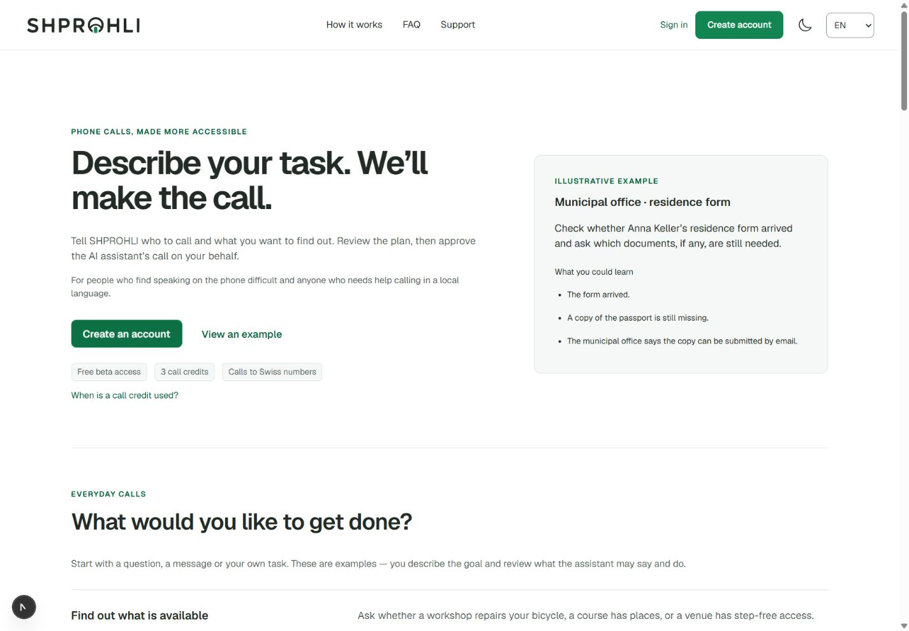
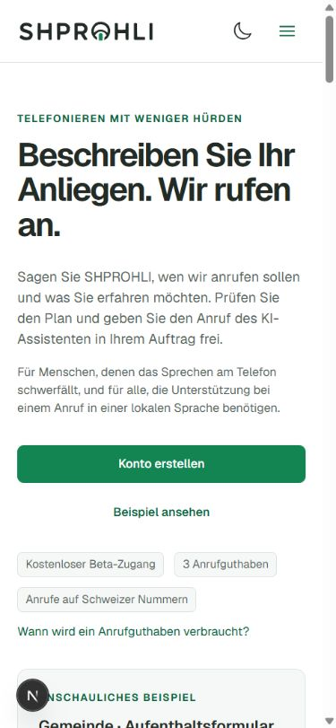
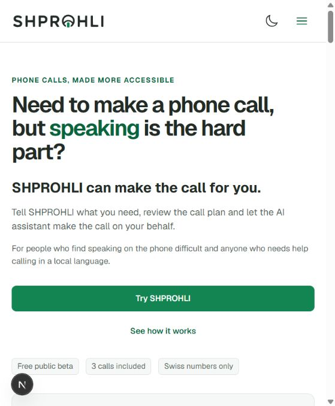
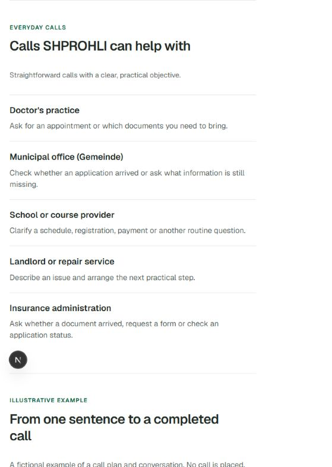
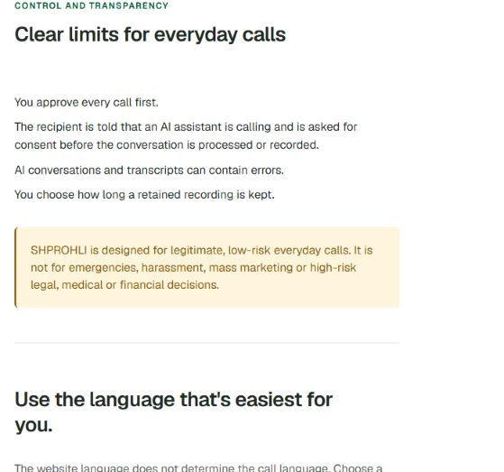

# B07 — главная перед первым деплоем

**Последний итог 14.09:** четыре продуктовые правки и интерактивное демо опубликованы
локально в **Landing r8, EN/DE**. [Текущее поведение, проверки и ограничения](interactive-landing-2026-09-14.md).
Ниже сохранена история предыдущего варианта и исходного аудита.

**Предыдущий checkpoint:** Landing r6 и FAQ collection r5
опубликованы локально в EN/DE, связанные Privacy/Terms/FAQ r4 и Acceptable Use r5
синхронизированы. Старые черновики сохранены отдельно с разрешения владельца.
Списание кредита перенесено на первый содержательный ответ после согласия —
[правило и границы приёмки](conversation-credit-2026-09-14.md).
Описание исходных проблем ниже сохранено как история проверки.

## Предыдущий вариант r6 (заменён интерактивным r8)

Hero сокращён; есть ясный CTA создания аккаунта, шесть групп задач, отдельная ссылка
на правила кредитов и точное уточнение, что швейцарские номера относятся к адресатам
звонков. За сценариями идут четыре шага. Длинный пример свёрнут в нативный `details`;
полный план, разговор и результат можно раскрыть клавиатурой. В CMS оставлен
редактор заголовка примера и объяснено, что его структурированное содержание
поддерживается в коде; старые невидимые поля больше не предлагаются к редактированию.
EN/DE строки элементов управления вынесены в типизированный словарь.

Проверены EN desktop и DE mobile: порядок и тексты, отсутствие горизонтального
переполнения, раскрытие примера клавишей Enter, ссылка к правилу кредита.
После публикации проверена основная страница localhost:3000: новый EN hero,
шесть сценариев, правила кредитов, тёмная тема и ширина 320 px; CTA открывает
форму регистрации. Данные формы не вводились и аккаунт не создавался.
На основной DE странице также проверены шесть сценариев, desktop/dark без
переполнения и новый параграф о кредитах в Terms. SSR-кэш публикаций обновляется
с интервалом 60 секунд: после первой выдачи старой версии повторно подтверждены
новые тексты обеих локалей. Снимки `06` и `07` сделаны уже после публикации.
Полная screen-reader/WCAG и реальная голосовая приёмка этим не подтверждены.
Локальные снимки получены из того же кандидата перед публикацией. Точные идентификаторы
ревизий и backup находятся в игнорируемой `.tools/public-content/`.
Imprint и его отдельный черновик не менялись. Деплой shprohli.ch остаётся следующим этапом.

Дата: 2026-09-14. Это конкретизация B07 в [едином родмапе](mvp-plan.md), не отдельный backlog.
Пользователь выбрал первый деплой сразу на `shprohli.ch` с временно ограниченным доступом,
но отложил его до доработки лендинга. Отдельный staging-домен не требуется.

## Текущая страница: проверка 14 сентября

Проверена открытая `http://localhost:3000/en` в браузере Codex; сохранены и просмотрены
свежие снимки. Основной вывод: сохранить существующий визуальный стиль, исправить
содержание, порядок блоков и публикацию. На момент исходных снимков изменения ещё не были внесены.

1. **Первый экран — понятная основа, неточное описание беты.** Видны аудитория,
   действие и ссылка на пример. «3 calls included» не объясняет расход при соединении,
   даже если задача не решена. «Swiss numbers only» не различает номер адресата звонка
   и номер регистрации, где разрешены также украинские мобильные.

   

2. **Сценарии — требуют переработки.** Пять типов организаций создают впечатление
   ограниченного каталога. Не видны консультация по согласованным вопросам и свободная
   постановка задачи. У каждой карточки есть заголовок и короткий текст: этот формат подходит
   и для групп задач.

   

3. **Контроль и данные — блокирующая неточность в тексте.** Страница обещает согласие
   до обработки разговора. Фактически AI обрабатывает ответ, чтобы распознать согласие;
   основная беседа и запись начинаются после него. Исправленное описание уже есть
   в `publicReleaseCopy` исходного seed, но открытая страница показывает старую публикацию.
   Предупреждение об ошибках AI и ссылка на поддержку должны сохраниться.

   

Ограничения этой проверки: текущая EN-страница и узкое окно браузера; не полноценная
мобильная/DE/клавиатурная приёмка. Визуально мелкие badges и длинный путь до сценариев
нуждаются в проверке при увеличении текста. Контраст, screen reader и соответствие WCAG
по этим снимкам не подтверждены. Регистрация, звонки и публикация CMS не выполнялись.

## Содержание шести карточек — кандидат EN/DE

Карточки описывают задачи; названия организаций используются как разные примеры внутри
них. Это не шесть новых технических режимов: все ведут к существующему свободному описанию
и проверке плана. На главной не обещаем перенос введённого текста через регистрацию,
пока такой перенос не реализован.

| Группа | EN | DE |
| --- | --- | --- |
| Информация и наличие | **Find out what is available.** Ask whether a workshop repairs your bicycle, a course has places, or a venue has step-free access. | **Angebote und Verfügbarkeit klären.** Fragen Sie, ob eine Werkstatt Ihr Velo repariert, ein Kurs freie Plätze hat oder ein Veranstaltungsort stufenlos zugänglich ist. |
| Ответы и предварительная консультация | **Get answers to your questions.** Ask a service provider or specialist about available options, requirements and how to prepare. You choose the questions the assistant asks. | **Antworten auf Ihre Fragen erhalten.** Fragen Sie einen Anbieter oder eine Fachperson nach Möglichkeiten, Voraussetzungen und der Vorbereitung. Sie bestimmen die Fragen des Assistenten. |
| Статус и документы | **Check progress and missing documents.** Find out whether an application arrived, a repair is ready, or which documents still need to be sent. | **Stand und fehlende Unterlagen klären.** Erfahren Sie, ob ein Antrag angekommen oder eine Reparatur fertig ist und welche Unterlagen noch fehlen. |
| Одна встреча | **Book or confirm an appointment.** Authorise one booking within your time limits, or confirm an existing appointment at its exact date and time. | **Einen Termin vereinbaren oder bestätigen.** Geben Sie eine Buchung innerhalb Ihrer Zeitfenster frei oder lassen Sie einen bestehenden Termin mit genauem Datum und Uhrzeit bestätigen. |
| Передать сообщение | **Pass on a message.** Report a repair issue, let a contact know you are running late, or ask a service provider to call you back. | **Eine Nachricht übermitteln.** Melden Sie einen Reparaturbedarf, kündigen Sie eine Verspätung an oder bitten Sie einen Anbieter um Rückruf. |
| Своя задача | **Describe your own task.** Write who to call, what you want to find out and what information may be shared. Review the plan before any call starts. | **Ein eigenes Anliegen beschreiben.** Schreiben Sie, wen wir anrufen sollen, was Sie erfahren möchten und welche Angaben wir weitergeben dürfen. Prüfen Sie den Plan vor dem Anruf. |

Консультация здесь — ответы **от выбранного адресата**, а не профессиональные рекомендации
от самого AI. Свой сценарий сохраняет все ограничения сервиса. Booking остаётся одной
явно разрешённой операцией; перенос/отмена, оплаты, депозиты и новые условия не обещаются.
Более широкий пул для примеров и fixtures уже записан в [исходном аудите, раздел 5](public-testing-audit-2026-09-13.md#5-лендинг-обещания-и-публикация--b07).

## Порядок реализации и приёмка

1. Сократить повторяющиеся объяснения hero; оставить помощь при речевом/языковом барьере,
   честное «Создать аккаунт» и «Посмотреть пример». Уточнить «звонки на швейцарские номера».
2. Поставить шесть групп задач ближе к началу. После них — четыре коротких шага:
   задача → проверка плана → подтверждение звонка → ответы и следующие действия.
3. Свернуть длинный учебный пример: оставить краткий запрос и результат, полный план и
   разговор раскрывать по желанию. Согласовать редактируемые CMS-поля примера с тем,
   что действительно выводится компонентом.
4. Синхронизировать credits, consent, временную запись/retention и языковые обещания в
   Landing/FAQ/Privacy/Terms. Не обещать новые языки интерфейса до их выпуска;
   язык сайта, звонка и результата объяснять отдельно.
5. Прочитать актуальные CMS draft/published revisions, перенести правки в свежую основу
   без перезаписи чужого черновика. Проверить EN/DE preview, затем публиковать контролируемо
   и записать revision IDs. Изменение seed само по себе не обновляет существующую CMS.
6. Проверить опубликованную главную: EN/DE, телефон/desktop, увеличение текста, клавиатура,
   раскрытие примера, CTA, FAQ, ссылки поддержки и юридических страниц. После этого
   вернуться к B06 и временному ограничению доступа на основном домене.
