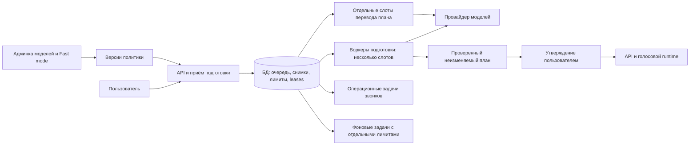

# План ускорения подготовки звонков и масштабирования воркеров

Дата: 2026-10-05. Исторический согласованный план. Программная реализация и
границы её проверки описаны в [отчёте](preparation-performance-implementation-2026-10-05.md)
и [runtime specification](preparation-runtime.md).
Основание: исследование исходного кода и предоставленная диагностика. Документ
не подтверждает конфигурацию или достигнутую ёмкость production.

## Приоритет после повторного аудита

[Повторный аудит реализации](preparation-implementation-audit-2026-10-05.md)
выявил точечные проблемы HTTP cleanup, Retry-After и ожидания БД. Для текущего
инцидента очередь не была значимой причиной. Поэтому описанная ниже архитектура
сохраняется как полный план развития, но не является обязательной первой
поставкой для устранения периодических задержек.

Первый этап уменьшен до исправлений транспорта и дедлайнов, проверки service
tier и дополнения существующей диагностики. При необходимости — потоковые
временные точки только генерации. Выбор моделей и Fast mode остаются отдельной
функцией; масштабирование выполнять при подтверждённой потребности в ёмкости.
Подробный порядок и критерии выбора следующего шага приведены в аудите.

## Цель и ожидаемый результат

Пользователь должен получать проверенный план с предсказуемым временем ожидания,
а задержка одного запроса к провайдеру не должна блокировать подготовки других
пользователей или обслуживание звонков. Администратор сможет выбрать модель
подготовки и отдельно включить Fast mode для этой модели. Выбор будет основан
на сравнении качества, задержек и стоимости на одинаковом наборе сценариев.

Архитектура должна использовать доступные ресурсы сервера и масштабироваться
на более мощный сервер изменением конфигурации. Результатом нагрузочной проверки
станут измеренный предел и рабочая ёмкость с запасом, а не число процессов,
приравненное к количеству CPU. Параметры текущего VPS и предлагаемые ступени
испытаний находятся в локальном приложении
`docs/local-operations/preparation-capacity-2026-10-05.md`.

В полный объём плана входят телеметрия потокового ответа, выбор модели и Fast mode,
выделенные роли воркеров, управление параллельностью, сравнительные испытания
и безопасный выпуск. Резервные параллельные запросы остаются выключенными.
Существующие проверки безопасности, языка и утверждения плана обязательны.

## Что известно о задержке

В рассмотренной подготовке ожидание очереди составило около 0,13 секунды.
От создания подготовки до публикации плана прошло около 47,85 секунды.

| Стадия | Время | Наблюдение |
| --- | ---: | --- |
| Проверка входных данных у провайдера | 1,60 с | Успешно |
| Первая генерация | 35,00 с | Таймаут до получения HTTP заголовков |
| Повтор генерации | 7,03 с | Успешно, обработка у провайдера около 6,77 с |
| Проверка языка | 1,34 с | Успешно |
| Проверка результата у провайдера | 2,48 с | Успешно |
| Всё вне этих запросов до публикации | Около 0,38 с | Включая очередь и локальные операции |

Перевод для просмотра стал готов примерно через 5 секунд после публикации плана.
Это отдельная стадия пользовательского ожидания; время фактического отображения
в браузере этими серверными измерениями не установлено.

Данные указывают на ожидание первого внешнего ответа как основной источник
этой задержки. Завершение отправки тела запроса локальным HTTP клиентом
не доказывает его получение провайдером. Без заголовков и раннего события нельзя
отделить задержку обработки у провайдера от проблемы доставки ответа.
Отсутствующие метрики нельзя интерпретировать как нулевые.

В небольшой предоставленной выборке было два таймаута генерации по 35 секунд.
Её недостаточно для оценки частоты проблемы или вывода о превосходстве модели.
Входящие пакеты, заблокированные UFW на посторонних портах, не объясняют
задержку исходящего запроса. Пустой журнал заданного unit за короткое окно
тоже не устанавливает причину.

Предыдущее исследование: [диагностика задержек подготовки](preparation-latency-diagnostics-2026-10-04.md).

## Ограничения текущей реализации

1. `DurableJobWorker` выполняет одну задачу за раз в каждой своей линии.
   Все `brief_compilation` одного процесса делят одну такую линию. Несколько
   процессов могут разбирать очередь через `FOR UPDATE SKIP LOCKED`, но
   общих лимитов параллельности и гарантии справедливого обслуживания нет.
2. Текущий `worker.ts` запускает полный набор компонентов. Его копирование
   размножает пулы БД и фоновые циклы. Некоторые операции уже защищены
   блокировками и идемпотентностью, но это не делает весь bootstrap безопасным
   для произвольного количества экземпляров.
3. `CallService.initialize()` вызывает восстановление прерванных звонков.
   Добавление процесса подготовки не должно приводить к пересмотру состояния
   текущих звонков. Простое увеличение числа существующих worker unit недопустимо.
4. Перевод плана для просмотра использует общую очередь текстовых артефактов.
   Он может ждать за другими задачами, даже когда генерация плана уже закончена.
5. Лимиты пулов суммируются: у полного воркера есть call repository, auth,
   уведомления, экспорт и другие подключения. Фактическое использование
   ленивых пулов может быть меньше суммы их максимумов, но рассчитывать
   безопасную конфигурацию только по текущему числу подключений нельзя.
6. Генерация использует один выбранный при запуске compiler и непотоковый ответ.
   Сохранение политики в админке потребует снимка настроек на подготовку,
   а не изменения общего mutable объекта во время работающих запросов.

## Целевая архитектура



| Роль | Задачи | Изоляция |
| --- | --- | --- |
| API и голосовой runtime | Приём запросов, webhook, текущие разговоры | Резерв CPU, памяти, БД и внешних квот |
| Подготовка | Генерация, проверки, исправления плана | Несколько асинхронных слотов; ограничение по пользователю и провайдеру |
| Просмотр плана | Перевод `plan_review` | Отдельная линия; может работать в процессе подготовки с собственным лимитом |
| Операционные задачи | Сроки ожидания ответа, сверка состояния звонка, завершение live transcript | Отдельный процесс и линии; задержки подготовки их не занимают |
| Фоновые задачи | Финальная транскрипция, прочие текстовые артефакты, retention, экспорт, уведомления, удаление аккаунтов, billing sync | Ограниченные линии; тяжёлые операции не занимают операционные слоты |

Окончательное распределение каждой разновидности durable job зафиксировать
в явной таблице маршрутизации. Сверку стоимости звонков можно оставить
в операционной роли в отдельной линии. Общие периодические задачи должны иметь
распределённого владельца или безопасный идемпотентный enqueue; уже имеющиеся
блокировки billing sync сохранить.

Ввести неизменяемый `work_class` для текстового артефакта и задания. Заполнять
его при enqueue, а для старых записей однозначно выводить из вида артефакта.
Потребители должны выбирать только свой класс: наличие отдельного review
воркера не поможет, если старый неограниченный потребитель забирает его задачи.

Воркеры подготовки не создают зависимости телефонии, billing sync, уведомлений
или экспорта и не вызывают глобальное восстановление звонков. Восстановление
привязать к подтверждённой потере владельца звонка и операционной роли.
Запуск нового экземпляра сам по себе не является свидетельством сбоя старого.
Горизонтальное распределение самих live разговоров требует отдельного проекта;
эта работа обеспечивает безопасное масштабирование подготовки рядом с ними.

## Лимиты параллельности и справедливость

Разделить четыре независимых ограничения:

- Количество процессов роли на хосте, их CPU и память.
- Количество одновременно исполняемых подготовок и переводов.
- Количество внешних запросов, включая moderation, audit, repair и retries.
- Бюджет подключений и запросов к БД, а также квоты и бюджет провайдера.

Ожидание внешнего ответа почти не использует CPU. Поэтому сначала увеличивать
число асинхронных слотов в небольшом числе процессов; дополнительные процессы
добавлять для изоляции отказов и при измеренной пользе. Значение `nproc`
не является ни числом допустимых запросов, ни обязательным числом процессов.

Начальный продуктовый лимит для испытаний: одна активная подготовка и не более
двух ожидающих на пользователя. Значения конфигурируемые; повтор с тем же
ключом идемпотентности возвращает прежнюю подготовку и не занимает новое место.
Отдельно ограничить общую очередь. При переполнении вернуть понятное сообщение
и `Retry-After`, сохранив черновик; не принимать работу с заведомо исчерпанным
сроком выполнения. Обработку локализовать в существующем пользовательском UI.

Справедливость реализовать в общем планировщике БД: выбирать следующего
пользователя по очередности последнего старта, затем его самое старое доступное
задание. Допустима эквивалентная схема с виртуальным временем, если тесты
подтверждают отсутствие голодания. Один пользователь не может занять все слоты
множеством разных ключей. Приоритет review ограничить весами и квотами,
чтобы он не вытеснил новые подготовки.

Claim задания и получение слота выполнять одной короткой транзакцией.
Не удерживать транзакцию, соединение или блокировку БД во время HTTP ожидания.
Ожидание свободного слота не расходует попытку выполнения. Слоты и heartbeat
имеют владельца, срок действия и fencing token — возрастающий номер владения.
Для времени lease использовать часы БД; каждый новый claim меняет token.

Обновление lease, запись результата задачи и публикация плана обязаны проверять
token вместе с владельцем и сроком. При потере lease отменить локальные запросы
и запретить публикацию старым исполнителем. Позднюю информацию о расходах
можно сохранить идемпотентно в отдельном журнале, но она не возвращает владение.
Восстановление просроченного слота не доказывает, что старый запрос прекратил
исполняться на стороне провайдера; такие операции учитывать как неопределённые.

Общий ограничитель запросов должен учитывать model family и область реальных
квот провайдера. Fast и Standard не считать независимыми бюджетами запросов.
Вызовы за пределами собственного шлюза, включая некоторые голосовые операции,
невозможно жёстко ограничить этим semaphore: для них нужен резерв квот,
отдельное наблюдение и при необходимости отдельный проект провайдера.
При нехватке квоты приостанавливать новые подготовки, сохраняя обслуживание
звонков. Реакцию на 429 и reset заголовки делать общей для процессов.

Лимиты ёмкости применяются к новым claims сразу; уменьшение лимита не отменяет
уже исполняемые задания. Версия модели закрепляется за подготовкой и от таких
изменений не зависит. При недоступной БД новые задания не запускать.

Повторные запросы ограничить единым сохранённым бюджетом на подготовку.
Не перемножать retries транспорта, repair, worker и резервного запроса.
Текущий общий срок подготовки 120 секунд, включая очередь, на первом этапе
сохранить. План может публиковаться только один раз, однако гарантировать
единственный платный вызов внешнего API после сетевого сбоя невозможно.

## Выбор модели и Fast mode в админке

Добавить раздел «Подготовка плана» по образцу существующей политики consent:
чтение для администратора, изменение для superadmin, причина изменения,
проверка ожидаемой ревизии, история предыдущего и нового значения. Конфликт
ревизии возвращает 409 и требует перечитать текущую политику.

Основные поля интерфейса:

| Поле | Поведение |
| --- | --- |
| Модель подготовки | Выбор из серверного списка проверенных профилей |
| Fast mode | Отдельный переключатель; доступен только для поддерживаемого профиля |
| Результат проверки качества | Дата и версия набора испытаний, краткий итог |
| Ожидаемые задержка и цена | Измеренные значения с размером выборки, без обещания SLA |
| Версия политики и причина | Показываются перед сохранением и в истории |

Начальная политика сохраняет действующую модель `gpt-5.6` и выключенный Fast.
Кандидаты для сравнения: `gpt-5.6-terra` и `gpt-6-luna`. Их доступность и свойства
проверяются для конкретного проекта, региона и API. Поддержка structured outputs
и streaming необходима, но сама по себе не подтверждает качество нашего плана.
См. [GPT-5.6 Terra](https://developers.openai.com/api/docs/models/gpt-5.6-terra)
и [GPT-6 Luna](https://developers.openai.com/api/docs/models/gpt-6-luna).

Модель и Fast в первой версии распространяются на генерацию и её repair.
Модель проверки языка и модель перевода для просмотра сохраняются отдельными
профилями; их настройки тоже записываются в снимок. Так сравнение генераторов
не смешивается с одновременной заменой проверяющей модели. UI явно объясняет
область действия настройки. Модели разговора этим разделом не меняются.

При приёме подготовки атомарно сохранить снимок: revision политики, профили
стадий, requested model, reasoning, verbosity, лимиты вывода, service tier,
версии prompt и схемы, бюджет повторов и общий deadline. Retries используют
тот же снимок. Смена администратором модели влияет только на новые подготовки.
Повтор idempotency key возвращает прежнюю запись со старым снимком.
Новая явно запрошенная переработка плана создаёт новую подготовку и снимок.

Compiler должен принимать неизменяемый профиль операции. Не переключать общую
модель процесса через глобальную переменную. Для каждой операции хранить также
фактическую модель из ответа. При наличии официальных model snapshots
предпочитать проверенные snapshots; перемещение alias учитывать как изменение
наблюдаемого поведения и повод для повторной оценки.

Standard отправляет `service_tier: default`, Fast — `service_tier: fast`.
Сохранять запрошенный и фактический tier отдельно. Для GPT-5.6 ответ может
содержать `priority` даже при запросе `fast`; нормализовать это для отчёта,
сохранив исходное значение. Возможен возврат к стандартной обработке.
Fast использует общие с обычным режимом rate limits и стоит дороже; увеличение
скорости всего процесса заранее не гарантируется.
[Документация Fast mode](https://developers.openai.com/api/docs/guides/fast-mode).

Неподдерживаемую комбинацию запрещать до сохранения. Не включать скрытый fallback
на другую модель или платный tier. Если отдельно разрешён возврат к Standard,
отображать его в диагностике и учитывать в бюджете повторов. Непроверенный
профиль доступен только в режиме оценки и не выбирается как общий production
default. Сохранение настройки не должно запускать платную проверку автоматически.

Существующая ценовая политика не покрывает все предлагаемые сочетания.
Добавить версионируемые тарифы по модели, фактическому tier и типу токенов,
включая cached input. Временные скидки не зашивать в постоянную логику.
Резерв бюджета до запроса должен покрывать выбранный профиль и возможные повторы.
Неизвестный расход после таймаута показывать как неизвестный, а не нулевой.
Исторические записи не пересчитывать молча по новой цене. Сверка фактического
расхода идемпотентна и не должна повторно списывать один provider operation.

## Потоковый ответ и диагностика

Перевести генерацию и repair на Responses streaming внутри backend. Пользователю
по-прежнему показывается только полностью собранный, проверенный и сохранённый
план. Streaming позволяет раньше увидеть жизненный цикл ответа; он не устраняет
долгое ожидание до первых заголовков и не гарантирует ускорение всей генерации.
Основания: [Streaming Responses](https://developers.openai.com/api/docs/guides/streaming-responses)
и [Production best practices](https://developers.openai.com/api/docs/guides/production-best-practices).

Парсер обязан корректно обрабатывать разрывы UTF-8 и SSE между сетевыми порциями,
несколько событий в одной порции, служебные события, refusal, failed, incomplete,
обрыв соединения и отсутствие terminal event. Ограничить размер собираемого
ответа и буферов. Частичный JSON никогда не публикуется. Проверку схемы,
локальных правил, языка и moderation выполнять над завершённым кандидатом.

Сохранять следующие временные точки и связи:

- Создание подготовки, enqueue, claim, ожидание общего и провайдерского слота.
- Начало каждой стадии и попытки; резерв бюджета и завершение операции в БД.
- Создание HTTP запроса, локальная отправка тела, заголовки ответа.
- Первое SSE событие, ранний response ID, первый output delta, завершение потока.
- Публикация плана, enqueue и готовность review; отдельный browser ready event,
  если он будет реализован, с явным указанием, что это клиентское наблюдение.
- Worker instance, role, host label, lease token, policy revision, requested
  и actual model/tier, response/request/client request IDs, usage, retry reason.

Для длительностей использовать монотонные часы, для сопоставления записей — UTC.
Офсеты от начала операции нельзя складывать как длительности независимых стадий.
`X-Client-Request-Id` сохранять до отправки: он полезен при обращении в поддержку,
если ответ и серверный request ID не получены.
[Request IDs и заголовки API](https://developers.openai.com/api/reference/overview).
Не считать ранний response ID гарантией возможности получить результат позже
при `store: false`.

Сохранить существующее разделение request scoped диагностики для параллельных
запросов. Не приписывать событие общего сокета или DNS конкретному запросу
без доказанной связи, особенно при keep alive и multiplexing. Ненаблюдаемую
стадию хранить как null. Версионировать новый формат диагностики; старые записи
версии 1 должны оставаться читаемыми без выдуманных временных точек.

На первом этапе сохранить действующий предел 35 секунд на попытку генерации
и общий deadline подготовки, чтобы смена транспорта не изменила retry policy
одновременно с измерениями. Позже разделить предел ожидания заголовков,
отсутствия прогресса и полного запроса по накопленной статистике. Отсутствие
output delta во время reasoning не считать автоматически зависанием.
Каждая стадия и повтор должны помещаться в оставшийся общий бюджет времени.

## Хранение и наблюдаемость

Точные имена таблиц определить при миграции; нужны следующие сущности:

| Сущность | Назначение |
| --- | --- |
| Версии политики подготовки | Модель, tier, профили стадий, автор, причина, revision |
| Снимок подготовки | Неизменяемая связь политики и параметров с конкретным запуском |
| Состояние внешней операции | Ранние IDs и ограниченное число checkpoints до terminal result |
| Окончательный результат операции | Immutable diagnostics, usage, статус и ошибка |
| Leases и лимиты | Распределённые слоты, fencing, общие и пользовательские ограничения |
| Heartbeat воркера | Роль, версия, активные слоты, состояние drain, сведения о пуле |

Не делать запись в БД на каждый delta. На запрос предусмотреть ограниченное
число контрольных записей, например до 8, с объединением некритичных событий
и ограниченной очередью записи. Terminal result и расход сохранять надёжно;
потерю промежуточных диагностических событий явно считать и показывать.
При аварии между checkpoints результат должен означать «неизвестно», а не
«успешно». Периодический sampler ресурсов работает с фиксированной частотой,
не зависит от количества токенов и тоже имеет ограничение объёма.

Диагностические записи содержат метаданные, а не prompt, текст разговора,
ответы модели, телефоны, токены доступа или произвольные заголовки.
Сохранять только разрешённый список provider headers. Доступ, экспорт и удаление
применяются по существующим правилам аккаунта и звонка. Предлагаемая верхняя
граница хранения подробной диагностики — 30 дней; обезличенных агрегатов —
90 дней. Более раннее удаление по существующей политике имеет приоритет.
Сроки обязательных финансовых записей этим планом не меняются.

Расширить текущий telemetry export снимками политики, стадиями, checkpoints,
терминальными результатами, пропусками и контекстом загрузки. Обновить allowlist,
схему, manifest и проверки совместимости экспорта. В интерфейсе оператора
показывать единую временную шкалу подготовки и связь с переводом для просмотра.

Обязательные метрики:

- End to end до публикации и до готовности просмотра; очередь отдельно.
- p50, p95, p99 и размер выборки по модели, tier и версии профиля.
- Таймауты, обрывы потока, 429, repairs, повторы, ошибки валидации и неизвестный расход.
- Requested Fast, фактически предоставленный Fast и возвраты к Standard.
- Активные и ожидающие задания по роли; возраст старейшего; отказы admission.
- Event loop delay, RSS, CPU, pool wait, соединения БД, lease loss и восстановления.
- Задержки webhook и голосовых обработчиков, разрывы звонков, работа другой нагрузки хоста.

Не строить вывод о p95 только по успешным быстрым запросам: таймауты — цензурированные
наблюдения, которые отдельно входят в отчёт о доступности и полном времени
подготовки с повторами. Не использовать user ID и request ID как labels метрик
высокой кардинальности; они нужны для точечного поиска в журнале.

## Проверка качества и стоимости моделей

Обещание «без потери качества» подтверждать только в пределах проверенного
набора и дальнейшего наблюдения. Сначала зафиксировать baseline текущей модели
на том же prompt, схеме и наборе проверок. Сравнивать Standard и Fast отдельно,
не смешивая их в одну среднюю задержку.

Набор должен покрывать все поддерживаемые языки, смешанный язык, сложные даты
и часовые пояса, имена и адреса, неполные вводные, неоднозначности, запреты,
согласие, потенциально небезопасные цели, длинные задания и атаки на инструкции.
Использовать синтетические или разрешённые обезличенные случаи. Отложить часть
набора для итоговой проверки, чтобы не подгонять решение под одни примеры.

Предлагаемый порядок: smoke на 20 случаях, затем не менее 200 случаев для
прошедших профилей, по два запуска для оценки нестабильности. Это план платной
проверки, не разрешение выполнить её сейчас. До запуска показать число
запросов, оценку цены и жёсткий денежный предел. Учитывать moderation, audit,
repair и перевод, если они включены в сравниваемый путь.

Критерии допуска:

1. Ни одной новой критической ошибки в проверенном наборе: выдуманного факта,
   неверного действия, потери обязательного ограничения или обхода согласия.
2. Доля пригодных планов и repairs не хуже baseline в согласованном допуске;
   решения оценивать вслепую по смыслу, а не буквальному совпадению текста.
3. Выигрыш полного времени и хвостовых задержек подтверждён повторными прогонами.
4. Итоговая цена, частота fallback и неизвестный расход представлены вместе
   с задержкой. Дешёвый первый запрос с частыми repairs не считать дешёвым планом.
5. Отчёт сохраняет версии данных, кода, prompt, модели и тарифов. Непроверенный
   профиль не становится общим default автоматически.

После допуска — ограниченное включение для выбранной группы пользователей
с наблюдением и возвратом к предыдущей политике для новых подготовок.
Production запросы не дублировать ради сравнения без отдельного включения
и бюджета. Текущие утверждённые планы и активные звонки при смене политики
продолжают использовать свои данные.

## Определение ёмкости

Обозначения: P — число процессов подготовки, S — слоты генерации на процесс,
R — отдельные review слоты, D — максимальный размер всех пулов одного процесса.
Теоретическая локальная параллельность подготовки равна P × S. Реальная
допустимая параллельность дополнительно ограничена общими слотами, внешними
квотами, памятью, БД и резервом для звонков. Review и другие роли расходуют
ресурсы отдельно, их нельзя забывать в расчёте.

Для PostgreSQL необходимо соблюдать:

```text
P × D + сумма максимумов остальных пулов и отдельных соединений
    <= max_connections - резерв администрирования и безопасности
```

Считать все процессы, API, web/server компоненты, listeners и временные readers.
Предпочесть общий пул внутри роли, передаваемый зависимостям; установить явные
небольшие размеры. Переподключение при сбое тоже не должно создавать шторм.
PgBouncer рассматривать только после инвентаризации session locks, LISTEN
и других требований к постоянной сессии; его установка не заменяет бюджет БД.

Нагрузочный стенд должен воспроизводить время и размер provider streams,
проверки, translation, ошибки, таймауты и одновременные звонки. Сначала использовать
управляемый mock provider для проверки локальной ёмкости без платного всплеска.
Отдельный ограниченный тест реального API проверяет квоты и реальную задержку.
Mock не подтверждает ёмкость внешнего провайдера или акустическое качество звонков.

На каждой ступени измерять baseline, устойчивую нагрузку не менее 60 минут
и ограниченный всплеск очереди. Включать сценарии медленного пользователя,
многих пользователей, переводов, экспорта и фоновой обработки. Проверить
падение воркера, потерю lease, рестарт процесса, недоступность БД и 429.
Подготовка и звонки других пользователей должны продолжаться в своих пределах.

Начальные критерии для испытаний, уточняемые по baseline:

| Показатель | Предлагаемый критерий |
| --- | --- |
| Очередь подготовок | p95 не более 2 с при заявленной устойчивой нагрузке |
| Полное время | Цель p95 до 25 с до публикации; оценивать отдельно от готовности перевода; достижимость пока не подтверждена |
| Голосовые обработчики | Нет новых ошибок и разрывов; рост p95 не более большего из 10% baseline и 50 мс |
| CPU | Устойчивое среднее не выше 70% выделенной ёмкости, без длительного saturation |
| Память | Не менее 20% запаса в лимите приложения и согласованный резерв всего хоста |
| PostgreSQL | Все максимумы пулов укладываются в бюджет; нет устойчивой очереди за соединением |
| Корректность | Нет двойной публикации, межпользовательских утечек, голодания, неожиданных завершений звонков |

Рост остановить при нарушении критериев либо когда следующая ступень почти
не увеличивает пропускную способность. Зафиксировать отдельно последнюю
прошедшую ступень, первую неудачную или непроверенную и рабочий режим
с дополнительным запасом примерно 20–30% по нагрузке. Если верхний предел
не достигнут, результат называется «проверено до», а не «максимум сервера».
Указывать число одновременных звонков и прочую нагрузку, при которых получен результат.

Увеличение сервера требует повторной проверки, а не изменения алгоритма.
Настройки процессов, слотов, пулов и ресурсов передаются конфигурацией;
глобальные leases и fairness уже находятся в БД. Для нескольких хостов добавить
уникальные instance IDs, защищённое подключение к БД и общие лимиты провайдера.
Размещение голосового runtime при этом автоматически не меняется.

Предлагаемый контракт конфигурации ниже не является списком уже существующих
переменных окружения. При реализации выбрать единый способ загрузки и валидации.

| Уровень | Параметры |
| --- | --- |
| Процесс | `role`, `instanceId`, `compileSlots`, `reviewSlots`, `dbPoolMax`, `drainTimeoutMs` |
| Развёртывание хоста | Число экземпляров каждой роли, CPU и memory limits, резерв для API и звонков |
| Общая политика ёмкости в БД | `maxActivePreparations`, `maxQueuedPreparations`, `perUserActive`, `perUserQueued`, веса классов очереди |
| Провайдер | Общие request permits по области квот, резерв для звонков, retry и денежный бюджеты |
| Политика качества в БД | Версия профилей стадий, выбранная модель и Fast; снимок закрепляется при приёме |

На старте отклонять отрицательные и несовместимые значения. Если число локальных
слотов превышает общий предел, исполнять только разрешённое общим admission
количество; лишние слоты не создают дополнительную внешнюю нагрузку. Показывать
оператору настроенную и фактически доступную ёмкость каждой роли. Контроль
ресурсов допускает автоматическое уменьшение admission; увеличение верхнего
предела требует новой проверенной конфигурации и не происходит бесконтрольно.

## Порядок реализации полного объёма

Эта последовательность относится к полному развитию системы. Минимальный
первый этап после повторного аудита выполняется независимо от внедрения всех
ролей, админки и распределённого управления ёмкостью.

| Этап | Результат | Условие завершения |
| --- | --- | --- |
| 1. Инвентаризация и baseline | Карта jobs, pools, startup side effects, конфигурации и метрик | Известны все потребители подключений и опасные действия при запуске |
| 2. Основа масштабирования | Роли, shared pools, routing, fencing, глобальные слоты и fairness | Добавление и остановка prep процесса не затрагивает звонки; многопроцессные тесты проходят |
| 3. Политика подготовки | Версии, снимки, профили моделей, тарифы и бюджет | Повтор сохраняет параметры; старая политика и старые планы совместимы |
| 4. Админка | Выбор модели, Fast, audit history, обработка конфликтов | Проверены права, revision conflict, capability validation и область действия |
| 5. Streaming и наблюдаемость | SSE transport, ранние checkpoints, экспорт, метрики | Корректны завершение, обрывы, таймауты, параллельные запросы и ограничение объёма |
| 6. Сравнение моделей | Отчёт по качеству, задержке и цене | Допущены только профили с проверенным результатом и бюджетом |
| 7. Нагрузочная проверка | Проверенная ёмкость и рабочая конфигурация | Выполнены критерии при заявленном числе звонков и фоновой нагрузке |
| 8. Выпуск | Обновлённый deploy helper, role health, drain и возврат политики | Проверены миграция, поэтапное включение и восстановление после сбоя |

Телеметрию можно реализовывать после фиксации контрактов параллельно с админкой.
Увеличивать production параллельность до завершения этапов 2 и 7 нельзя.
Подключать новые модели как общий default до этапа 6 нельзя.

## Карта изменений и проверок

| Область исходников | Предлагаемые изменения |
| --- | --- |
| `packages/contracts/src/` | Политика подготовки, профиль, снимок, diagnostics v2, права и ответы админки |
| `apps/api/src/storage/` и миграции | Версии политики, атомарное admission, work class, fencing и общий бюджет слотов |
| `apps/api/src/jobs/durable-job-worker.ts` | Несколько слотов, lease loss cancellation, bounded drain и fairness через repository |
| `apps/api/src/worker.ts` и bootstrap | Роли и минимальные зависимости; устранение recovery звонков при запуске prep |
| `apps/api/src/call-service.ts` | Передача снимка, сквозной deadline, правила публикации и lifecycle review |
| `apps/api/src/brief-compiler/` | Профили на операцию, streaming parser, диагностика стадий и service tier |
| `apps/api/src/text-processing/` | Маршрутизация plan review и фиксация его профиля |
| `apps/api/src/config/provider-pricing-policy.ts` | Версии цен по модели и tier, резервирование и неизвестный расход |
| `apps/web/components/admin-system-console.tsx` и новый раздел | Настройки, история, результаты оценки, состояния сохранения |
| Telemetry export и admin diagnostics | Совместимость форматов, разрешённые поля, временная шкала |
| `scripts/shprohli-vps-release.sh` и локальные runbooks | Перечень ролей и экземпляров, health, drain и порядок выпуска |

Номера миграций назначить по актуальному состоянию ветки при реализации.
Обязательные проверки поведения:

- Смена модели и Fast во время обработки не меняет снимок или retry старой задачи.
- Несколько процессов не превышают общий лимит и не исполняют одну lease одновременно.
- Старый владелец после reclaim не продлевает lease и не публикует план.
- Один пользователь с большой очередью не вытесняет остальных.
- Все разновидности текстовых артефактов попадают к правильному потребителю.
- Изменение числа prep процессов не вызывает восстановления или завершения текущих звонков.
- SSE разорван на произвольных границах; нет terminal event; отказ, incomplete,
  большой ответ, превышение deadline и отмена не приводят к публикации частичного плана.
- ID и диагностические события параллельных операций не смешиваются.
- Fast requested и actual tier различаются; расход вычислен по верной версии тарифа.
- Telemetry export читает старые и новые записи, удаление аккаунта охватывает новые данные.

Использовать существующие тестовые инфраструктуры и PostgreSQL integration
tests для гонок и транзакций. Не подменять многопроцессные гарантии исключительно
тестами mock repository. Число и вид обязательных проверок CI сверить
с действующими инструкциями репозитория перед реализацией.

## Выпуск и возврат изменений

Миграции выполнять расширением схемы с совместимым чтением старых записей.
Для старых queued подготовок явно зафиксировать прежний профиль; если нельзя
надёжно восстановить параметр, завершить их старой версией до переключения.
Не приписывать историческим данным Fast или измерения, которых не было.

Сначала выпустить совместимые contracts и наблюдаемость с прежними настройками.
Перед переходом на маршрутизацию ролей прекратить новые claims старого полного
воркера, дождаться drain и проверить владельцев lease. Не допускать совместной
работы старого неограниченного consumer и новых role consumers для тех же jobs.
Активные голосовые соединения не перезапускать ради масштабирования подготовки.
Если конкретный выпуск требует API restart, следовать действующей процедуре
drain звонков и отдельному окну выпуска.

Обновить deploy helper: проверить все нужные роли и экземпляры, а не единственный
`shprohli-worker.service` или ровно один fresh heartbeat. Readiness означает
подключённую БД, совместимую схему, heartbeat и способность своей роли брать jobs.
При остановке сначала выключить claim, продолжать heartbeat до завершения
активных заданий; по истечении drain deadline отменить запросы и оставить
состояние для безопасного reclaim с новым token.

Быстрый возврат модели — новая ревизия прежней политики для новых подготовок.
Возврат транспорта или числа слотов — отдельные переключатели. После активации
новых снимков и leases нельзя просто запускать старый несовместимый binary:
нужна совместимая rollback версия либо drain и проверенный обратный переход.
Полезные финансовые и диагностические записи при rollback не удалять.

## Последующие улучшения

После накопления статистики можно параллельно выполнять независимые проверки
языка и moderation одного завершённого кандидата. При repair обе проверки
повторяются для нового кандидата, публикация ждёт обе. В рассмотренном случае
это потенциально экономит порядка секунды; проблему 35 секунд такой шаг
не устраняет. Дополнительные одновременные запросы требуют отдельных permit.

Резервный запрос по задержке рассматривать отдельным этапом: только для прошедшего
проверку профиля, с отдельным лимитом, долей трафика, бюджетом и отключением
при высокой нагрузке или 429. Победителя выбирает атомарная публикация;
отмена проигравшего не гарантирует отмену его оплаты. В первую поставку
этот механизм не входит.

Оптимизацию prompt, reasoning и лимита output tokens проверять тем же набором
качества. Кешировать можно неизменяемые служебные части; переиспользование
готового пользовательского плана требует точного совпадения входных данных,
версий и прав доступа. Покупка более мощного VPS поможет только при измеренном
локальном ограничении и не устранит сама по себе ожидание внешнего ответа.

## Итоговые условия приёмки

Работа завершена, когда администратор выбирает проверенный профиль и Fast,
каждая подготовка воспроизводимо связана со своим снимком, диагностика показывает
стадию задержки, а несколько пользователей обслуживаются в пределах общих
лимитов без влияния старта prep воркеров на текущие звонки. Частичный или
непроверенный план не публикуется; стоимость и неизвестные результаты видны.

К выпуску приложен отчёт об испытаниях: среда, число процессов и слотов,
конкурентные звонки, нагрузка, качество, задержки, цена, ресурсы, последняя
проверенная ступень и рабочий запас. До такого отчёта безопасный максимум
воркеров и обещание конкретного ускорения остаются неподтверждёнными.
